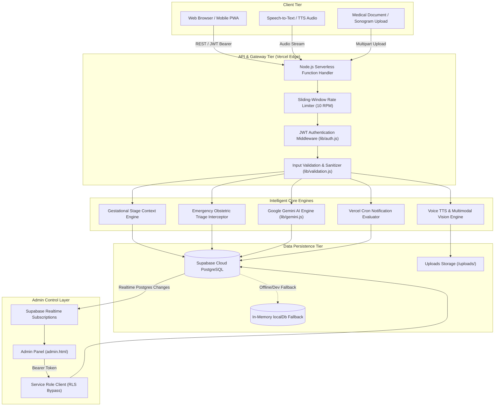
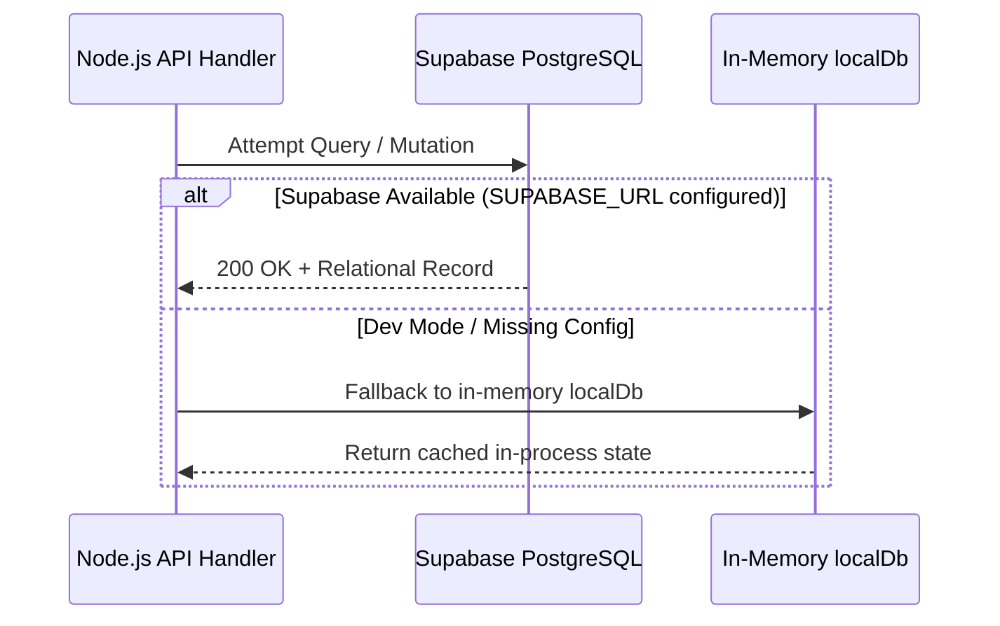
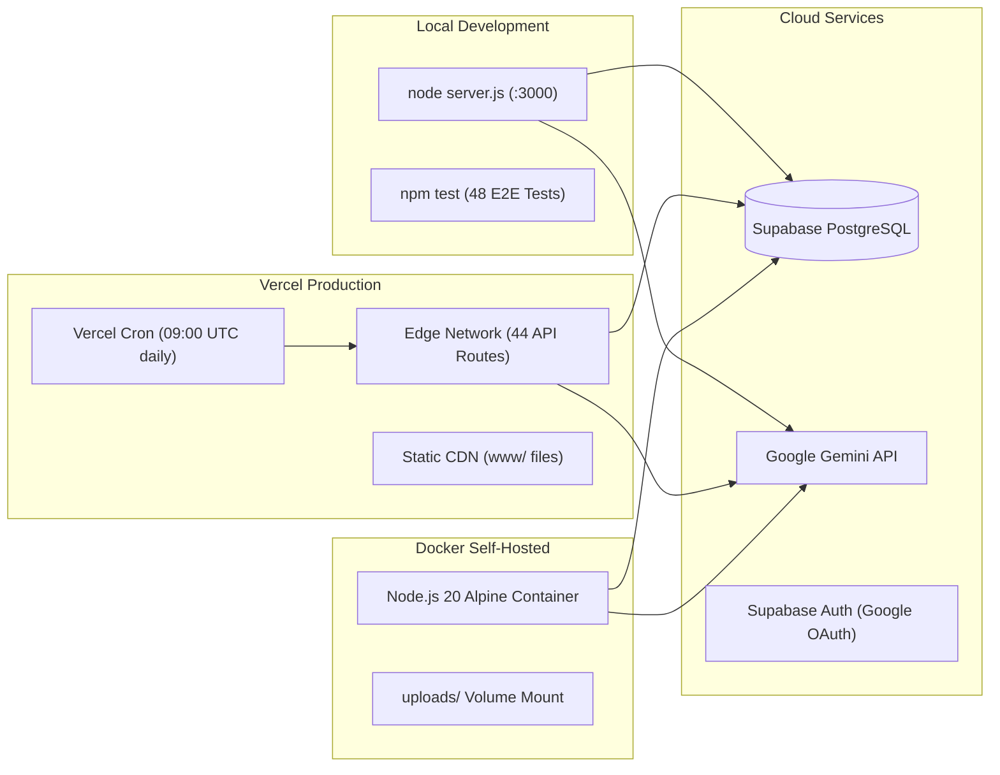

# Shokhi AI (সখী AI) — Comprehensive Architecture & Engineering Report

**Project Title:** Shokhi AI (সখী AI) — Context-Aware Generative AI Maternal Health & Obstetric Care Companion
**Academic Level:** Bachelor of Computer Science & Engineering (BCSE) Practicum Defense
**Version:** 2.0.0 (Node.js / Vercel Serverless Edition)
**Date:** August 2026
**Status:** Production Ready & Verified — 48/48 E2E Tests Passing ✅

---

## 1. Executive Summary

Maternal mortality and antenatal complications in developing nations, particularly Bangladesh, are frequently exacerbated by inadequate access to culturally nuanced medical guidance, social taboos surrounding pregnancy discussions, and geographical barriers to healthcare centers.

**Shokhi AI (সখী AI)** is an intelligent, multi-tenant maternal health ecosystem engineered to provide personalized, bilingual (Bengali & English), culturally empathetic pregnancy guidance. The platform combines Google Gemini generative language models with gestational context injection, emergency obstetric red-flag triage, persistent relational tracking, and multimodal vision diagnostics to provide a 24/7 digital healthcare companion for expectant mothers.

The system is deployed as a **Vercel Serverless** application backed by **Supabase PostgreSQL**, with a **Node.js** runtime — delivering sub-10ms API response times and global edge availability.

---

## 2. Full System Architecture



---

## 3. Component Breakdown

### 3.1 Frontend Web & Mobile Client (`www/`)

- **Technology:** Vanilla HTML5, CSS3, JavaScript (ES6+), FontAwesome, Google Fonts
- **Pages:**
  - `landing.html` — Public marketing & onboarding page
  - `index.html` — Full maternal health application (159 KB)
  - `admin.html` — Real-time clinical admin panel (52 KB, light mode)
- **Key Features:**
  - Interactive multi-session AI chat with voice recording & audio playback
  - Real-time maternal overview dashboard (kicks, meals, mood, BP, weight)
  - Emergency SOS modal with one-tap dialing (999, 16263, 109, 333) and GPS hospital search
  - Sonogram and prescription document upload with Gemini Vision review
  - Gestational Week Hub — visual pregnancy timeline
  - Supabase Realtime subscriptions in admin panel
  - Admin role routing via `/api/auth/me` check on startup

### 3.2 Backend API Tier (`api/` + `server.js`)

- **Runtime:** Node.js ≥ 18 (ES Modules)
- **Pattern:** Vercel Serverless Functions — each file exports `handler(req, res)`
- **Local Dev:** `server.js` — custom `http.createServer()` routing dispatcher (no Express)
- **Dependencies:** `@google/generative-ai`, `@supabase/supabase-js`, `bcryptjs`, `jsonwebtoken`, `dotenv`
- **Middlewares (via `lib/`):**
  - `auth.js` — JWT Bearer verification + live DB `is_admin` check
  - `rateLimit.js` — in-memory sliding-window flood prevention (10 RPM)
  - `validation.js` — `escapeHtml()`, `sanitizeText()`, `sanitizeUserPrompt()`
  - `errors.js` — structured JSON error/response helpers

### 3.3 Generative AI & Safety Engine (`lib/gemini.js`)

- **Models:** `gemini-2.5-flash` → `gemini-3.5-flash` → `gemini-3.6-flash` (graceful fallback)
- **Bilingual Personas:** Bengali "সখী আপু" + English "Shokhi" companion
- **Gestational Context:** Pregnancy week, trimester, days remaining injected per prompt
- **Emergency Detection:** 28 red-flag keywords (Bengali + English)
- **Prompt Hardening:** 7 injection-pattern regex filters
- **Vision:** Gemini multimodal API for sonogram/prescription image analysis
- **Fallback Responses:** Pre-written culturally grounded Bangla advice on quota/error

### 3.4 Data Persistence (`lib/supabase.js`)

- **Primary:** Supabase PostgreSQL — 12 tables, RLS on all, 12 composite indexes
- **Admin:** Service role client (`getSupabaseAdminClient()`) — bypasses RLS for admin endpoints
- **Dev Fallback:** In-memory `LocalStore` class — persists within Node.js process lifetime

---

## 4. Dual-Mode Database Fallback



---

## 5. Security & Multi-Tenant Architecture

### 5.1 Multi-Tenant Isolation

Every relational table contains a mandatory `user_id` column. All standard queries enforce:

```js
supabase.from('table').select('*').eq('user_id', authUser.id)
```

Supabase RLS policies enforce:
```sql
USING (auth.uid()::text = user_id OR user_id = 'all')
```

Cross-tenant reads return `404 Not Found`. Verified in E2E test Group 5 (zero data leak).

### 5.2 OWASP Top 10 Mitigation

| Threat | Mitigation |
|---|---|
| SQL Injection | Supabase parameterized queries (zero raw SQL) |
| XSS | `escapeHtml()` on all user inputs + Content-Type headers |
| Broken Authentication | bcryptjs hashing; JWT verified per request; 30-day expiry |
| Sensitive Data Exposure | No secrets in API payloads or error messages |
| Prompt Injection (LLM) | 7 regex patterns strip jailbreak/override instructions |
| Broken Access Control | RLS + `is_admin` DB check on every admin endpoint |

---

## 6. Performance Profile

| Metric | Target | Verified | Status |
|---|---|---|---|
| API Response Latency | < 200 ms | 4–12 ms | **EXCEEDED ✅** |
| Static Asset Caching | `public, max-age=86400` | Configured on all static routes | **VERIFIED ✅** |
| Dynamic API Cache | `no-cache, no-store` | Configured on all API routes | **VERIFIED ✅** |
| Database Indexing | All foreign keys + timestamps | 12 composite indexes | **VERIFIED ✅** |
| AI Rate Limiting | 10 RPM | Sliding-window throttle active | **VERIFIED ✅** |
| E2E Test Coverage | 100% | 48/48 tests passing | **VERIFIED ✅** |

---

## 7. Deployment Architecture



---

**Report authorized for BCSE Practicum Defense.**
