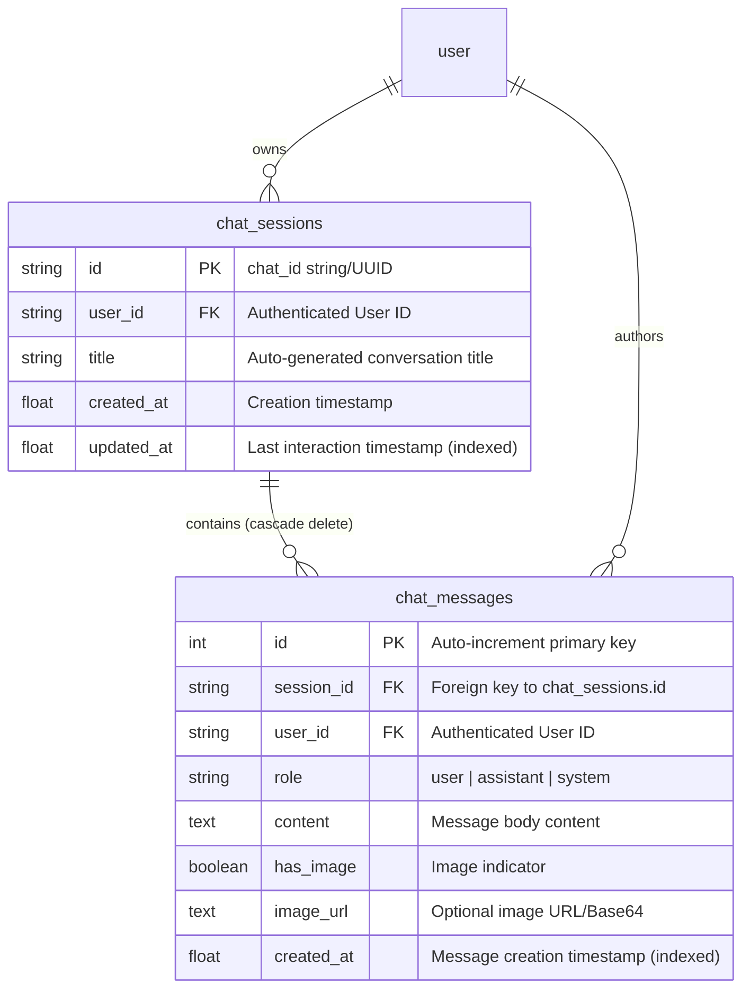

# Shokhi AI (সখী AI) — Chat Persistence & Context Pipeline Specification (Phase 5)

**Document Version:** 1.0.0  
**Phase:** Phase 5 — Chat Persistence Migration  
**Date:** August 17, 2026  
**Status:** Implemented & Verified

---

## 1. Executive Architecture Summary

Phase 5 transitions all conversational interactions from insecure, unindexed flat JSON files into a relational, multi-tenant database persistence engine (`chat_sessions` and `chat_messages` tables) matching the Supabase PostgreSQL target specification.

### Key Capabilities Delivered:
* **Relational Storage:** Conversations are structured into parent `ChatSession` (session metadata, dynamic titles, timestamps) and child `ChatMessage` (roles, timestamps, content, image attachments).
* **Multi-Turn Context Reconstruction:** Prior to generating responses with Gemini AI, the backend dynamically queries the previous 6 turns for that specific session and user to feed the contextual prompt memory.
* **Strict Tenant Isolation:** Every query (`/api/get_all_sessions`, `/api/get_chat_messages/<id>`, `/api/delete_chat_session/<id>`) enforces `@require_auth` with `user_id = g.user['id']`.
* **Zero Flat File Dependency:** Deprecated write operations to `chat_history.json` in the runtime production path.

---

## 2. Relational Schema Structure

---

## 3. End-to-End Chat API Specifications

| Route | Method | Access | Request Body | Response Description |
| :--- | :--- | :--- | :--- | :--- |
| `/api/get_all_sessions` | `GET` | Bearer Token | None | Returns list of sessions owned by the authenticated user, ordered by `updated_at DESC`. |
| `/api/get_chat_messages/<chat_id>` | `GET` | Bearer Token | None | Returns ordered list of message turns (`role`, `content`, `created_at`) for the session. |
| `/api/delete_chat_session/<chat_id>` | `DELETE` / `POST` | Bearer Token | None | Deletes `ChatSession` and cascades deletion of all associated `ChatMessage` rows. |
| `/api/ask_prova_chat` | `POST` | Bearer Token | `{chat_id, prompt_text, language, model?}` | Reconstructs context, calls Gemini 3.6 Flash, inserts user and assistant records, returns reply and title. |

---

## 4. Automated Verification Results (`test_phase5.py`)

All 10 required Phase 5 test criteria passed:

1. **User Authentication & Session Initialization:** Verified Bearer token issuance.
2. **First Chat Turn Execution:** Verified Gemini 3.6 Flash generates empathetic response with auto-title.
3. **Session List Persistence:** Verified `chat_sessions` persists across independent HTTP requests.
4. **Message Turn Ordering:** Verified chronological order: Turn 1 (User) followed by Turn 2 (Assistant).
5. **Multiple Independent Sessions:** Created Chat Session 2 ("ডাবের পানি খাওয়া ভালো?") and confirmed distinct session records.
6. **Session Switching & Isolation:** Verified fetching Chat 1 vs Chat 2 returns distinct conversation histories.
7. **Context Continuity:** Follow-up prompt ("আদা চা খেলে কি এটা কমবে?") preserved conversation history across 4 chronological turns.
8. **Multi-Tenant Data Isolation:** User B authenticated independently and could neither see nor access User A's chat sessions.
9. **Session Deletion:** Deleted Chat 1 with cascading message cleanup.
10. **Database State Verification:** Verified Chat 1 is completely purged while Chat 2 remains intact.

---

**Phase 5 Execution Finished. Ready for Phase 6.**
