# Shokhi AI (সখী AI) — Supabase PostgreSQL Database Design & Schema Specification

**Document Version:** 1.0.0  
**Phase:** Phase 2 — Supabase Database Design  
**Date:** August 17, 2026  
**Status:** Approved Technical Design Specification (Pre-Implementation)

---

## 1. Executive Summary & Objectives

This document establishes the official PostgreSQL relational database schema for **Shokhi AI (সখী AI)** on the Supabase platform. The schema replaces the flat JSON file (`chat_history.json`) and the single-table SQLite database (`prova_app.db`) with a normalized, relational, multi-tenant architecture.

### Core Objectives:
1. **Strict Data Normalization:** Eliminate data redundancy across chat sessions, conversational turns, user identities, and health records in accordance with Third Normal Form (3NF).
2. **Deterministic Multi-Tenant Isolation:** Enforce user data ownership through foreign key links to Supabase's `auth.users(id)` and PostgreSQL Row Level Security (RLS).
3. **Comprehensive Health Persistence:** Transition client-only DOM widgets (meals, vitals, mood, appointments, routines, kick counter, baby names) into persistent relational entities.
4. **Defense-Ready Schema Design:** Provide explicit constraints, indexes, cascade behaviors, and triggers defensible in a computer science practicum examination.

---

## 2. Relational Entity-Relationship Diagram (ERD)

```mermaid
erDiagram
    auth_users ||--|| profiles : "1:1 profile"
    auth_users ||--o{ pregnancy_profiles : "manages"
    auth_users ||--o{ chat_sessions : "owns"
    chat_sessions ||--o{ chat_messages : "contains"
    auth_users ||--o{ chat_messages : "authors"
    auth_users ||--o{ meal_logs : "records"
    auth_users ||--o{ vital_records : "logs"
    auth_users ||--o{ mood_symptoms : "tracks"
    auth_users ||--o{ appointments : "schedules"
    auth_users ||--o{ daily_routines : "completes"
    auth_users ||--o{ kick_records : "counts"
    auth_users ||--o{ saved_baby_names : "shortlists"
    auth_users ||--|| user_preferences : "configures"

    profiles {
        uuid id PK,FK
        varchar full_name
        varchar phone_number
        varchar preferred_language
        text avatar_url
        timestamptz created_at
        timestamptz updated_at
    }

    pregnancy_profiles {
        uuid id PK
        uuid user_id FK
        date lmp_date
        date expected_due_date
        int current_gestational_weeks
        int current_trimester
        boolean is_active
        timestamptz created_at
        timestamptz updated_at
    }

    chat_sessions {
        uuid id PK
        uuid user_id FK
        varchar title
        timestamptz created_at
        timestamptz updated_at
    }

    chat_messages {
        uuid id PK
        uuid session_id FK
        uuid user_id FK
        varchar role
        text content
        boolean has_image
        text image_url
        timestamptz created_at
    }

    meal_logs {
        uuid id PK
        uuid user_id FK
        varchar meal_type
        text description
        timestamptz logged_at
    }

    vital_records {
        uuid id PK
        uuid user_id FK
        int systolic
        int diastolic
        numeric weight_kg
        text notes
        timestamptz recorded_at
    }

    mood_symptoms {
        uuid id PK
        uuid user_id FK
        varchar entry_type
        varchar label
        varchar severity
        timestamptz logged_at
    }

    appointments {
        uuid id PK
        uuid user_id FK
        varchar doctor_name
        varchar hospital_clinic
        timestamptz appointment_time
        text notes
        boolean is_completed
        timestamptz created_at
    }

    daily_routines {
        uuid id PK
        uuid user_id FK
        varchar routine_key
        boolean is_completed
        date record_date
        timestamptz completed_at
    }

    kick_records {
        uuid id PK
        uuid user_id FK
        int kick_count
        timestamptz session_start
        timestamptz session_end
    }

    saved_baby_names {
        uuid id PK
        uuid user_id FK
        varchar name
        varchar gender
        text meaning
        timestamptz created_at
    }

    user_preferences {
        uuid id PK
        uuid user_id FK
        int hydration_interval_minutes
        boolean hydration_enabled
        numeric voice_rate
        numeric voice_pitch
        timestamptz updated_at
    }
```



---

## 3. Detailed PostgreSQL DDL Table Specifications

### 3.1 Common Functions & Triggers
```sql
-- Extension enablement
CREATE EXTENSION IF NOT EXISTS "uuid-ossp";
CREATE EXTENSION IF NOT EXISTS "pgcrypto";

-- Automatic timestamp updater trigger function
CREATE OR REPLACE FUNCTION update_updated_at_column()
RETURNS TRIGGER AS $$
BEGIN
    NEW.updated_at = NOW();
    RETURN NEW;
END;
$$ LANGUAGE plpgsql;
```

---

### 3.2 Core Identity & Profile Tables

#### Table 1: `profiles`
* **Purpose:** Extends Supabase `auth.users` with maternal user metadata and language preference.
```sql
CREATE TABLE IF NOT EXISTS public.profiles (
    id UUID PRIMARY KEY REFERENCES auth.users(id) ON DELETE CASCADE,
    full_name VARCHAR(150) NOT NULL,
    phone_number VARCHAR(30),
    preferred_language VARCHAR(5) DEFAULT 'bn' CHECK (preferred_language IN ('bn', 'en')),
    avatar_url TEXT,
    created_at TIMESTAMPTZ DEFAULT NOW() NOT NULL,
    updated_at TIMESTAMPTZ DEFAULT NOW() NOT NULL
);

CREATE TRIGGER trigger_update_profiles_timestamp
    BEFORE UPDATE ON public.profiles
    FOR EACH ROW EXECUTE FUNCTION update_updated_at_column();
```

#### Table 2: `pregnancy_profiles`
* **Purpose:** Stores gestational timeline, Last Menstrual Period (LMP), and expected delivery date calculations.
```sql
CREATE TABLE IF NOT EXISTS public.pregnancy_profiles (
    id UUID PRIMARY KEY DEFAULT gen_random_uuid(),
    user_id UUID NOT NULL REFERENCES auth.users(id) ON DELETE CASCADE,
    lmp_date DATE NOT NULL,
    expected_due_date DATE NOT NULL,
    current_gestational_weeks INTEGER DEFAULT 1 CHECK (current_gestational_weeks BETWEEN 1 AND 45),
    current_trimester INTEGER DEFAULT 1 CHECK (current_trimester IN (1, 2, 3)),
    is_active BOOLEAN DEFAULT TRUE NOT NULL,
    created_at TIMESTAMPTZ DEFAULT NOW() NOT NULL,
    updated_at TIMESTAMPTZ DEFAULT NOW() NOT NULL,
    CONSTRAINT valid_due_date CHECK (expected_due_date >= lmp_date)
);

CREATE TRIGGER trigger_update_pregnancy_profiles_timestamp
    BEFORE UPDATE ON public.pregnancy_profiles
    FOR EACH ROW EXECUTE FUNCTION update_updated_at_column();
```

---

### 3.3 Conversational AI & Session Tables

#### Table 3: `chat_sessions`
* **Purpose:** Represents individual conversation sessions owned by a specific authenticated user.
```sql
CREATE TABLE IF NOT EXISTS public.chat_sessions (
    id UUID PRIMARY KEY DEFAULT gen_random_uuid(),
    user_id UUID NOT NULL REFERENCES auth.users(id) ON DELETE CASCADE,
    title VARCHAR(255) DEFAULT 'New Chat' NOT NULL,
    created_at TIMESTAMPTZ DEFAULT NOW() NOT NULL,
    updated_at TIMESTAMPTZ DEFAULT NOW() NOT NULL
);

CREATE TRIGGER trigger_update_chat_sessions_timestamp
    BEFORE UPDATE ON public.chat_sessions
    FOR EACH ROW EXECUTE FUNCTION update_updated_at_column();
```

#### Table 4: `chat_messages`
* **Purpose:** Stores every message turn (user prompt vs. Shokhi AI response) linked to a session.
```sql
CREATE TABLE IF NOT EXISTS public.chat_messages (
    id UUID PRIMARY KEY DEFAULT gen_random_uuid(),
    session_id UUID NOT NULL REFERENCES public.chat_sessions(id) ON DELETE CASCADE,
    user_id UUID NOT NULL REFERENCES auth.users(id) ON DELETE CASCADE,
    role VARCHAR(20) NOT NULL CHECK (role IN ('user', 'assistant', 'system')),
    content TEXT NOT NULL,
    has_image BOOLEAN DEFAULT FALSE NOT NULL,
    image_url TEXT,
    created_at TIMESTAMPTZ DEFAULT NOW() NOT NULL
);
```

---

### 3.4 Maternal Health & Wellness Tracker Tables

#### Table 5: `meal_logs`
* **Purpose:** Persists daily nutritional logs categorized by meal type with timestamp.
```sql
CREATE TABLE IF NOT EXISTS public.meal_logs (
    id UUID PRIMARY KEY DEFAULT gen_random_uuid(),
    user_id UUID NOT NULL REFERENCES auth.users(id) ON DELETE CASCADE,
    meal_type VARCHAR(50) NOT NULL,
    description TEXT NOT NULL,
    logged_at TIMESTAMPTZ DEFAULT NOW() NOT NULL
);
```

#### Table 6: `vital_records`
* **Purpose:** Records physiological health metrics (Systolic/Diastolic BP and maternal body weight).
```sql
CREATE TABLE IF NOT EXISTS public.vital_records (
    id UUID PRIMARY KEY DEFAULT gen_random_uuid(),
    user_id UUID NOT NULL REFERENCES auth.users(id) ON DELETE CASCADE,
    systolic INTEGER CHECK (systolic BETWEEN 40 AND 300),
    diastolic INTEGER CHECK (diastolic BETWEEN 30 AND 200),
    weight_kg NUMERIC(5, 2) CHECK (weight_kg BETWEEN 20.00 AND 350.00),
    notes TEXT,
    recorded_at TIMESTAMPTZ DEFAULT NOW() NOT NULL
);
```

#### Table 7: `mood_symptoms`
* **Purpose:** Logs maternal emotional wellbeing ratings and pregnancy discomforts (nausea, fatigue, etc.).
```sql
CREATE TABLE IF NOT EXISTS public.mood_symptoms (
    id UUID PRIMARY KEY DEFAULT gen_random_uuid(),
    user_id UUID NOT NULL REFERENCES auth.users(id) ON DELETE CASCADE,
    entry_type VARCHAR(20) NOT NULL CHECK (entry_type IN ('mood', 'symptom')),
    label VARCHAR(100) NOT NULL,
    severity VARCHAR(20) DEFAULT 'mild' CHECK (severity IN ('mild', 'moderate', 'severe')),
    logged_at TIMESTAMPTZ DEFAULT NOW() NOT NULL
);
```

#### Table 8: `appointments`
* **Purpose:** Manages scheduled consultations with gynecologists, obstetricians, and ultrasound clinics.
```sql
CREATE TABLE IF NOT EXISTS public.appointments (
    id UUID PRIMARY KEY DEFAULT gen_random_uuid(),
    user_id UUID NOT NULL REFERENCES auth.users(id) ON DELETE CASCADE,
    doctor_name VARCHAR(150) NOT NULL,
    hospital_clinic VARCHAR(200),
    appointment_time TIMESTAMPTZ NOT NULL,
    notes TEXT,
    is_completed BOOLEAN DEFAULT FALSE NOT NULL,
    created_at TIMESTAMPTZ DEFAULT NOW() NOT NULL
);
```

#### Table 9: `daily_routines`
* **Purpose:** Tracks the completion state of daily prenatal routines (vitamins, walking, water, kicks) per calendar day.
```sql
CREATE TABLE IF NOT EXISTS public.daily_routines (
    id UUID PRIMARY KEY DEFAULT gen_random_uuid(),
    user_id UUID NOT NULL REFERENCES auth.users(id) ON DELETE CASCADE,
    routine_key VARCHAR(100) NOT NULL,
    is_completed BOOLEAN DEFAULT FALSE NOT NULL,
    record_date DATE DEFAULT CURRENT_DATE NOT NULL,
    completed_at TIMESTAMPTZ,
    CONSTRAINT unique_user_routine_per_day UNIQUE (user_id, routine_key, record_date)
);
```

#### Table 10: `kick_records`
* **Purpose:** Records baby fetal movement kick counting sessions for clinical tracking.
```sql
CREATE TABLE IF NOT EXISTS public.kick_records (
    id UUID PRIMARY KEY DEFAULT gen_random_uuid(),
    user_id UUID NOT NULL REFERENCES auth.users(id) ON DELETE CASCADE,
    kick_count INTEGER NOT NULL DEFAULT 0 CHECK (kick_count >= 0),
    session_start TIMESTAMPTZ DEFAULT NOW() NOT NULL,
    session_end TIMESTAMPTZ
);
```

#### Table 11: `saved_baby_names`
* **Purpose:** Shortlists favorite baby names with gender categorizations and meanings.
```sql
CREATE TABLE IF NOT EXISTS public.saved_baby_names (
    id UUID PRIMARY KEY DEFAULT gen_random_uuid(),
    user_id UUID NOT NULL REFERENCES auth.users(id) ON DELETE CASCADE,
    name VARCHAR(100) NOT NULL,
    gender VARCHAR(20) DEFAULT 'unspecified' CHECK (gender IN ('boy', 'girl', 'unspecified')),
    meaning TEXT,
    created_at TIMESTAMPTZ DEFAULT NOW() NOT NULL
);
```

#### Table 12: `user_preferences`
* **Purpose:** Stores user-specific device and alert configurations (hydration reminder interval, TTS settings).
```sql
CREATE TABLE IF NOT EXISTS public.user_preferences (
    id UUID PRIMARY KEY DEFAULT gen_random_uuid(),
    user_id UUID UNIQUE NOT NULL REFERENCES auth.users(id) ON DELETE CASCADE,
    hydration_interval_minutes INTEGER DEFAULT 60 CHECK (hydration_interval_minutes BETWEEN 15 AND 360),
    hydration_enabled BOOLEAN DEFAULT TRUE NOT NULL,
    voice_rate NUMERIC(3, 2) DEFAULT 0.95 CHECK (voice_rate BETWEEN 0.5 AND 2.0),
    voice_pitch NUMERIC(3, 2) DEFAULT 1.10 CHECK (voice_pitch BETWEEN 0.5 AND 2.0),
    updated_at TIMESTAMPTZ DEFAULT NOW() NOT NULL
);

CREATE TRIGGER trigger_update_user_preferences_timestamp
    BEFORE UPDATE ON public.user_preferences
    FOR EACH ROW EXECUTE FUNCTION update_updated_at_column();
```

---

## 4. Performance Indexing Strategy

To guarantee sub-10ms query execution across active multi-tenant dashboards, high-cardinality foreign keys and timestamp ordering columns are indexed with B-Tree indexes:

```sql
-- Profiles & Pregnancy
CREATE INDEX IF NOT EXISTS idx_pregnancy_profiles_user_active ON public.pregnancy_profiles(user_id, is_active);

-- Chat Sessions & Messages
CREATE INDEX IF NOT EXISTS idx_chat_sessions_user_updated ON public.chat_sessions(user_id, updated_at DESC);
CREATE INDEX IF NOT EXISTS idx_chat_messages_session_created ON public.chat_messages(session_id, created_at ASC);
CREATE INDEX IF NOT EXISTS idx_chat_messages_user ON public.chat_messages(user_id);

-- Health & Wellness Trackers
CREATE INDEX IF NOT EXISTS idx_meal_logs_user_logged ON public.meal_logs(user_id, logged_at DESC);
CREATE INDEX IF NOT EXISTS idx_vital_records_user_recorded ON public.vital_records(user_id, recorded_at DESC);
CREATE INDEX IF NOT EXISTS idx_mood_symptoms_user_logged ON public.mood_symptoms(user_id, logged_at DESC);
CREATE INDEX IF NOT EXISTS idx_appointments_user_time ON public.appointments(user_id, appointment_time ASC);
CREATE INDEX IF NOT EXISTS idx_daily_routines_user_date ON public.daily_routines(user_id, record_date);
CREATE INDEX IF NOT EXISTS idx_kick_records_user_start ON public.kick_records(user_id, session_start DESC);
CREATE INDEX IF NOT EXISTS idx_saved_baby_names_user ON public.saved_baby_names(user_id);
```

---

## 5. Row Level Security (RLS) Policy Specifications

Every table has Row Level Security enabled. Policies guarantee that an authenticated user can only perform `SELECT`, `INSERT`, `UPDATE`, and `DELETE` operations on records where `user_id = auth.uid()` (or `id = auth.uid()` on `profiles`).

```sql
-- 1. Enable RLS on all tables
ALTER TABLE public.profiles ENABLE ROW LEVEL SECURITY;
ALTER TABLE public.pregnancy_profiles ENABLE ROW LEVEL SECURITY;
ALTER TABLE public.chat_sessions ENABLE ROW LEVEL SECURITY;
ALTER TABLE public.chat_messages ENABLE ROW LEVEL SECURITY;
ALTER TABLE public.meal_logs ENABLE ROW LEVEL SECURITY;
ALTER TABLE public.vital_records ENABLE ROW LEVEL SECURITY;
ALTER TABLE public.mood_symptoms ENABLE ROW LEVEL SECURITY;
ALTER TABLE public.appointments ENABLE ROW LEVEL SECURITY;
ALTER TABLE public.daily_routines ENABLE ROW LEVEL SECURITY;
ALTER TABLE public.kick_records ENABLE ROW LEVEL SECURITY;
ALTER TABLE public.saved_baby_names ENABLE ROW LEVEL SECURITY;
ALTER TABLE public.user_preferences ENABLE ROW LEVEL SECURITY;

-- 2. Profiles RLS Policies
CREATE POLICY "Users can read own profile" ON public.profiles
    FOR SELECT USING (auth.uid() = id);
CREATE POLICY "Users can insert own profile" ON public.profiles
    FOR INSERT WITH CHECK (auth.uid() = id);
CREATE POLICY "Users can update own profile" ON public.profiles
    FOR UPDATE USING (auth.uid() = id);

-- 3. Generic User-Owned Entity RLS Policies (Applied to each tracker table)
DO $$
DECLARE
    tbl text;
BEGIN
    FOR tbl IN SELECT unnest(ARRAY[
        'pregnancy_profiles', 'chat_sessions', 'chat_messages',
        'meal_logs', 'vital_records', 'mood_symptoms',
        'appointments', 'daily_routines', 'kick_records',
        'saved_baby_names', 'user_preferences'
    ])
    LOOP
        EXECUTE format('
            CREATE POLICY "Users can read own %1$I" ON public.%1$I
                FOR SELECT USING (auth.uid() = user_id);
            CREATE POLICY "Users can insert own %1$I" ON public.%1$I
                FOR INSERT WITH CHECK (auth.uid() = user_id);
            CREATE POLICY "Users can update own %1$I" ON public.%1$I
                FOR UPDATE USING (auth.uid() = user_id);
            CREATE POLICY "Users can delete own %1$I" ON public.%1$I
                FOR DELETE USING (auth.uid() = user_id);
        ', tbl);
    END LOOP;
END $$;
```

---

## 6. Normalization & Academic Software Engineering Justification

| Normal Form | Compliance Criteria | Implementation in Shokhi AI Schema |
| :--- | :--- | :--- |
| **First Normal Form (1NF)** | Atomic column values, unique primary keys, no repeating groups. | Every entity possesses a distinct UUID primary key. Array/multivalue columns are avoided; repeating daily habits are represented as discrete `daily_routines` and `meal_logs` rows. |
| **Second Normal Form (2NF)** | In 1NF and no non-prime attribute is partially dependent on any candidate key. | All tables use single-attribute surrogate keys (`id UUID`), eliminating partial dependencies on composite keys. |
| **Third Normal Form (3NF)** | In 2NF and no non-prime attribute is transitively dependent on the primary key. | User identity attributes reside strictly in `profiles`. Session titles exist in `chat_sessions`, not duplicated inside individual `chat_messages`. |
| **Boyce-Codd (BCNF)** | For every functional dependency $X \to Y$, $X$ is a superkey. | All functional dependencies have primary keys or unique candidate keys (e.g. `(user_id, routine_key, record_date)`) as determinants. |

---

## 7. Migration Strategy & Transitional Compatibility

### 7.1 Multi-Stage Phased Migration Plan
1. **Schema Initialization (Phase 3):** Execute the DDL script on the target Supabase PostgreSQL instance. Verify extensions, triggers, RLS policies, and index creation.
2. **Authentication Integration (Phase 4):** Connect Supabase Auth in the frontend and Flask backend (`@require_auth`). Verify user sign-up triggers automatic row insertion into `public.profiles`.
3. **Data Access Layer Switch (Phase 5):**
   * Refactor Flask repository handlers to query Supabase via the official `supabase-py` SDK or PostgREST client using user-scoped JWTs.
   * Provide a one-way migration script (`scripts/migrate_sqlite_to_supabase.py`) to convert existing test discussions from `chat_history.json` and `prova_app.db` into `chat_sessions` and `chat_messages`.
4. **Widget Persistence Switch (Phase 7):** Connect all 8 frontend health tools to Flask REST endpoints backed by the respective PostgreSQL tables.
5. **SQLite & JSON Deprecation:** Once end-to-end testing confirms zero regressions, remove `chat_history.json` and SQLite database dependencies.

---

**Phase 2 Execution Finished.**  
*Database design is complete and documented. SQLite has been preserved.*  
*Ready for Phase 3.*
