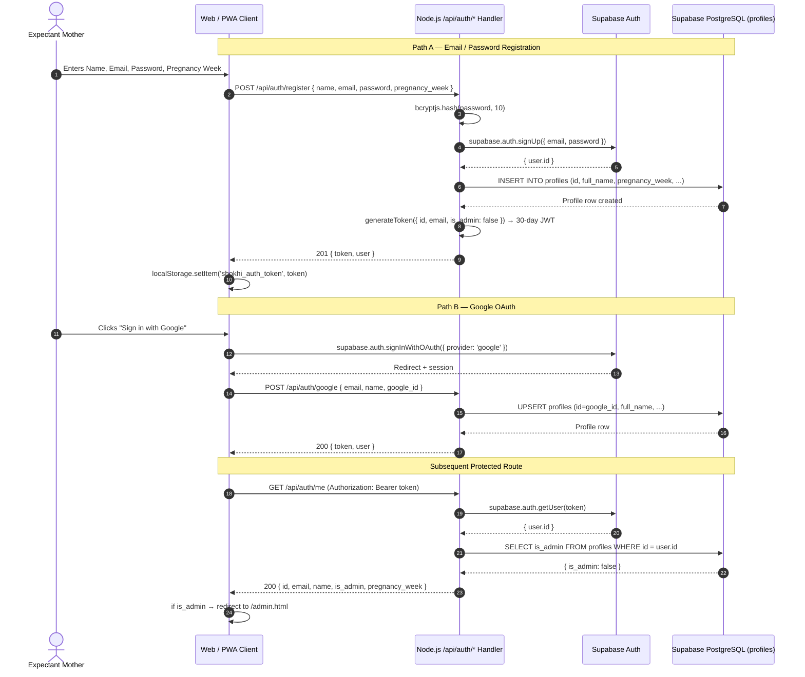
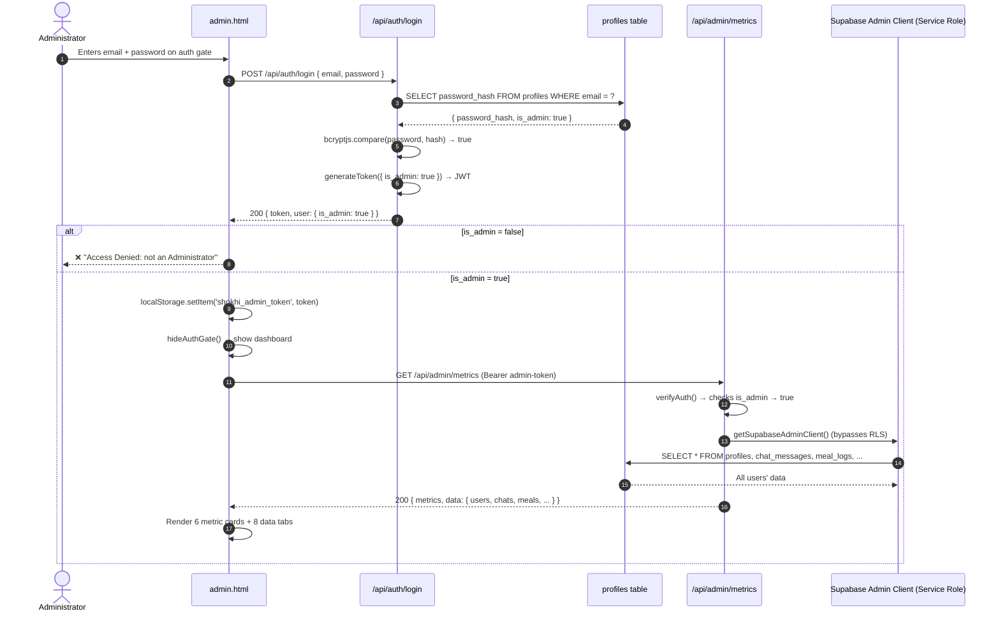
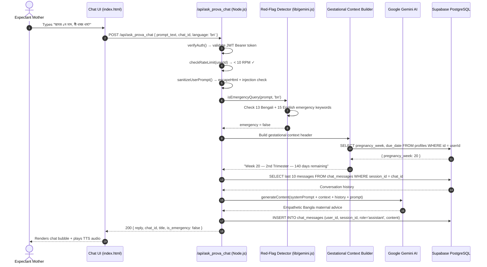
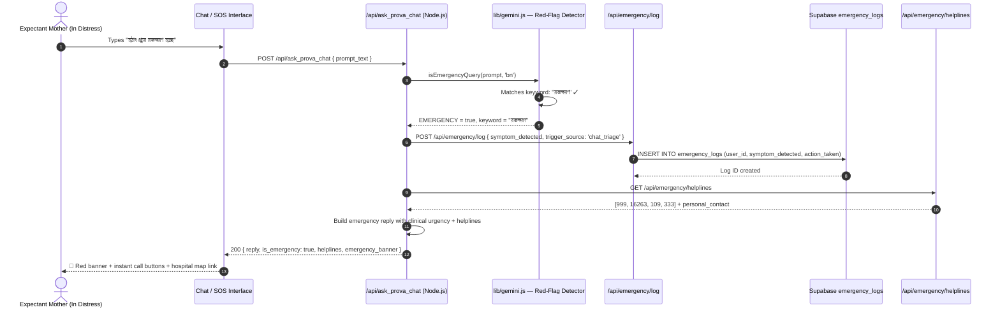
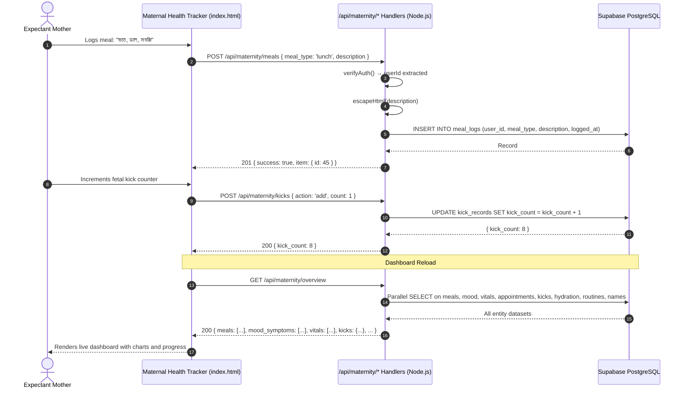
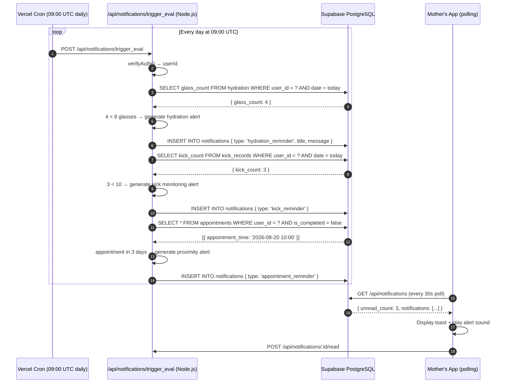
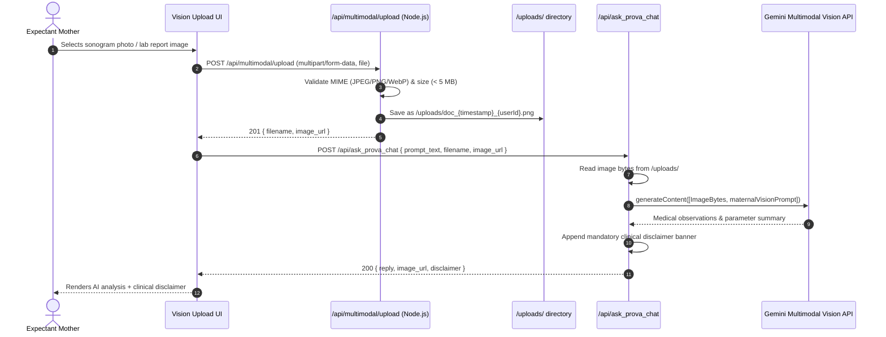

# Shokhi AI (সখী AI) — Comprehensive Data Flow Diagrams

**Document Version:** 2.0.0
**Runtime:** Node.js / Vercel Serverless
**Date:** August 2026
**Status:** Verified — reflects current Node.js codebase

---

## 1. Authentication & Tenant Session Flow

---

## 2. Admin Login & RBAC Flow

---

## 3. Context-Aware Generative Chat Flow

---

## 4. Emergency Obstetric Triage & Red-Flag Escalation

---

## 5. Persistent Maternal Health Tracking Lifecycle

---

## 6. Smart Notification Engine Flow

---

## 7. Multimodal Vision — Sonogram & Prescription Analysis

---

**Data Flow Diagrams — Node.js / Vercel Serverless Edition. All flows verified by 48-test E2E suite.**
