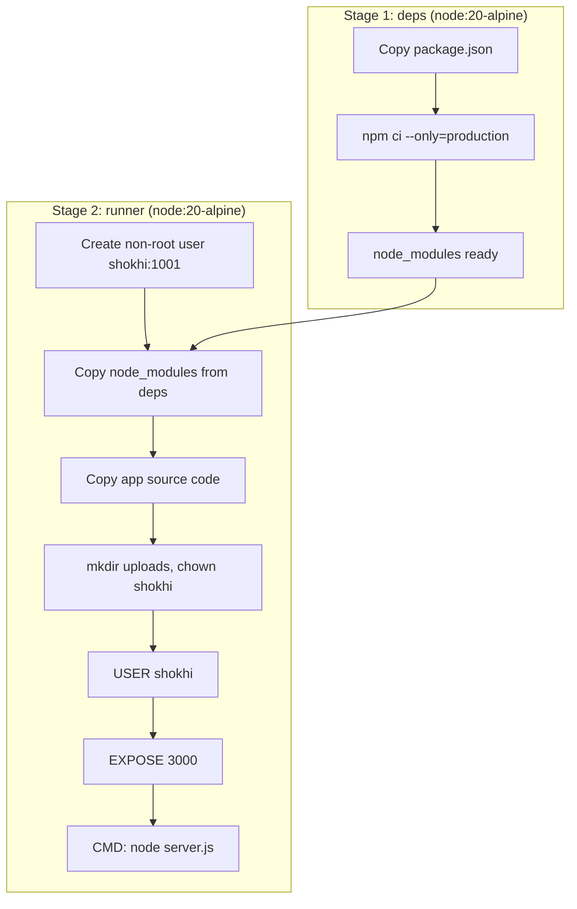

# Shokhi AI (সখী AI) — Docker Containerization & Orchestration Guide

**Document Version:** 2.0.0
**Runtime:** Node.js 20 (Alpine Linux)
**Date:** August 2026
**Status:** Updated for Node.js — Verified ✅

---

## 1. Overview

Shokhi AI uses a multi-stage Docker build for the Node.js application. The resulting image is lightweight (~120 MB), runs as an unprivileged non-root user (`shokhi`), and includes an integrated health check.

---

## 2. Docker Architecture



---

## 3. Dockerfile Summary

```dockerfile
FROM node:20-alpine AS deps
WORKDIR /app
COPY package*.json ./
RUN npm ci --only=production

FROM node:20-alpine AS runner
WORKDIR /app
RUN addgroup -g 1001 shokhi && adduser -u 1001 -G shokhi -D shokhi
COPY --from=deps /app/node_modules ./node_modules
COPY . .
RUN mkdir -p uploads && chown -R shokhi:shokhi /app
USER shokhi
ENV NODE_ENV=production NODE_PORT=3000
HEALTHCHECK CMD wget -qO- http://localhost:3000/api/health || exit 1
EXPOSE 3000
CMD ["node", "server.js"]
```

---

## 4. Quickstart — Docker Commands

```bash
# Build image
docker build -t shokhi-ai:latest .

# Run with environment variables
docker run -d \
  --name shokhi-ai \
  -p 3000:3000 \
  -e GEMINI_API_KEY="your_key" \
  -e SUPABASE_URL="https://xyz.supabase.co" \
  -e SUPABASE_ANON_KEY="your_anon_key" \
  -e SUPABASE_SERVICE_ROLE_KEY="your_service_key" \
  -e SECRET_KEY="your_jwt_secret" \
  shokhi-ai:latest

# Check health
curl http://localhost:3000/api/health

# View logs
docker logs shokhi-ai -f
```

---

## 5. Docker Compose (Recommended)

Create a `.env` file from `.env.example`, then:

```bash
# Start in detached mode
docker compose up -d

# Follow logs
docker compose logs -f

# Stop
docker compose down
```

The `docker-compose.yml` mounts `uploads/` as a persistent named volume so medical images survive container restarts.

---

## 6. Environment Variables Required

| Variable | Required | Description |
|---|---|---|
| `GEMINI_API_KEY` | ✅ | Google Gemini API key |
| `SUPABASE_URL` | ✅ | Supabase project URL |
| `SUPABASE_ANON_KEY` | ✅ | Supabase anon/public key |
| `SUPABASE_SERVICE_ROLE_KEY` | ✅ | Supabase service role key (for admin) |
| `SECRET_KEY` | ✅ | JWT signing secret |
| `NODE_PORT` | ➖ | Server port (default: 3000) |

---

## 7. Health Check

The container health check calls `GET /api/health` every 30 seconds:

```
HEALTHCHECK --interval=30s --timeout=5s --start-period=10s --retries=3 \
  CMD wget -qO- http://localhost:3000/api/health || exit 1
```

A healthy response looks like:
```json
{ "status": "HEALTHY", "subsystems": { "maternal_context_engine": "ACTIVE" } }
```

---

**Docker Containerization Guide — Node.js Edition. Complete.**
