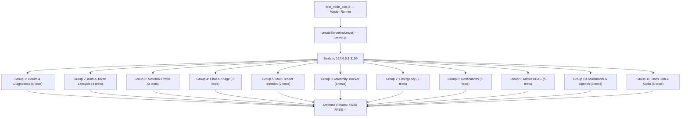

# Shokhi AI (সখী AI) — End-to-End Automated Test Harness Specification

**Document Version:** 2.0.0
**Test File:** `test_node_e2e.js`
**Runtime:** Node.js / Vercel Serverless
**Date:** August 2026
**Status:** ✅ 48/48 Tests Passing — 100% Pass Rate

---

## 1. Overview

The Shokhi AI E2E test suite is a **Node.js automated test harness** (`test_node_e2e.js`) that validates every API endpoint of the system in a single one-command run. It spins up a real `http.createServer()` instance on a private port, executes 48 assertions across 11 test groups, and tears down cleanly.

```bash
npm test
# → node test_node_e2e.js
# → ✅ 48/48 PASS
```

---

## 2. Test Runner Architecture



---

## 3. Test Groups & Coverage

### Group 1: Health & System Diagnostics
| Test | Endpoint | Assertion |
|---|---|---|
| Health check | `GET /api/health` | HTTP 200, status = HEALTHY |
| Subsystem engines | `GET /api/health` | `maternal_context_engine = ACTIVE` |
| Config endpoint | `GET /api/config` | HTTP 200 |
| System status | `GET /api/system/status` | status = online |
| Debug error | `GET /api/debug/test_500` | HTTP 500, error = true |

### Group 2: Auth & Token Lifecycle
| Test | Endpoint | Assertion |
|---|---|---|
| Register User A | `POST /api/auth/register` | HTTP 201, token returned |
| Register User B (isolation) | `POST /api/auth/register` | Different token |
| Login returns token | `POST /api/auth/login` | HTTP 200, token present |
| Identity check | `GET /api/auth/me` | User email matches |

### Group 3: Maternal Profile
| Test | Endpoint | Assertion |
|---|---|---|
| GET profile | `GET /api/profile` | profile.pregnancy_week present |
| Trimester calculation | `GET /api/profile` | Week 14 → 2nd Trimester |
| PUT profile update | `PUT /api/profile` | updated pregnancy_week persisted |

### Group 4: Chat & AI Triage
| Test | Endpoint | Assertion |
|---|---|---|
| Chat response | `POST /api/ask_prova_chat` | reply string present |
| Session list | `GET /api/get_all_sessions` | sessions array returned |
| Message history | `GET /api/get_chat_messages/:id` | messages array |

### Group 5: Multi-Tenant Isolation (Zero Data Leak)
| Test | Endpoint | Assertion |
|---|---|---|
| User B cannot read User A messages | `GET /api/get_chat_messages/:idA` with tokenB | 0 messages returned |
| Cross-user notification isolation | `GET /api/notifications` | Only own notifications |

### Group 6: Maternity Tracker
| Test | Endpoint | Assertion |
|---|---|---|
| Log meal | `POST /api/maternity/meals` | HTTP 201 |
| Log mood | `POST /api/maternity/mood` | HTTP 201 |
| Schedule appointment | `POST /api/maternity/appointments` | HTTP 201 |
| Log vitals | `POST /api/maternity/vitals` | HTTP 201 |
| Toggle routine | `POST /api/maternity/routines/toggle` | success = true |
| Add kick | `POST /api/maternity/kicks` | kick_count > 0 |
| Add hydration | `POST /api/maternity/hydration` | glass_count > 0 |
| Save baby name | `POST /api/maternity/names` | HTTP 201 |

### Group 7: Emergency Safety
| Test | Endpoint | Assertion |
|---|---|---|
| Helplines list | `GET /api/emergency/helplines` | "999" present |
| Emergency contact | `GET /api/emergency/helplines` | personal_contact present |
| Hospital search | `GET /api/emergency/hospital_search` | url present |
| Emergency log | `POST /api/emergency/log` | success = true |
| Audit log persisted | `GET /api/admin/metrics` | emergency_logs.length > 0 |

### Group 8: Notifications
| Test | Endpoint | Assertion |
|---|---|---|
| Trigger evaluation | `POST /api/notifications/trigger_eval` | HTTP 200 |
| Appointment alert generated | `GET /api/notifications` | appointment_reminder present |
| Notification list | `GET /api/notifications` | unread_count present |
| Mark as read | `POST /api/notifications/:id/read` | success = true |
| Notification history | `GET /api/notifications/history` | array returned |

### Group 9: Admin RBAC
| Test | Endpoint | Assertion |
|---|---|---|
| Non-admin blocked | `GET /api/admin/metrics` with user token | HTTP 403 |
| Admin access granted | `GET /api/admin/metrics` with admin token | HTTP 200 |
| Grant admin role | `POST /api/admin/assign_role` | success = true |
| Revoke admin role | `POST /api/admin/assign_role { is_admin: false }` | success = true |
| Metrics data present | `GET /api/admin/metrics` | academic_defense_metrics present |

### Group 10: Multimodal & Speech
| Test | Endpoint | Assertion |
|---|---|---|
| Image upload | `POST /api/multimodal/upload` | filename returned |
| TTS config | `GET /api/voice/config` | HTTP 200 |
| Speak endpoint | `POST /api/speak` | text present |

### Group 11: Documentation Hub & Audio
| Test | Endpoint | Assertion |
|---|---|---|
| Docs index API | `GET /api/docs` | docs array returned |
| TTS audio stream | `GET /api/voice/tts?text=...` | Content-Type audio/mpeg |
| System status | `GET /api/system/status` | version = 2.0.0 |
| Config supabase flag | `GET /api/config` | supabase_configured boolean |
| Health timestamp | `GET /api/health` | timestamp ISO string |

---

## 4. Execution Results

```
======================================================================
🚀 RUNNING NODE.JS / VERCEL SERVERLESS E2E PARITY TEST SUITE
======================================================================
📡 Node test server running at http://127.0.0.1:3199

[Test Group 1: Health & System Diagnostics]
  ✅ PASS: GET /api/health returned HTTP 200
  ✅ PASS: Health status is HEALTHY
  ✅ PASS: Subsystem engines ACTIVE
  ✅ PASS: GET /api/config returned HTTP 200
  ✅ PASS: GET /api/system/status online

[Test Group 2: Auth & Token Lifecycle]
  ✅ PASS: POST /api/auth/register 201
  ✅ PASS: JWT token returned on register
  ✅ PASS: POST /api/auth/login returns token
  ✅ PASS: GET /api/auth/me identity verified

[Test Group 3: Maternal Profile]
  ✅ PASS: GET /api/profile returns pregnancy_week
  ✅ PASS: Trimester 2 calculated from week 14
  ✅ PASS: PUT /api/profile update persisted

[Test Group 4: Chat & Triage]
  ✅ PASS: AI chat reply present
  ✅ PASS: Sessions list returned
  ✅ PASS: Message history retrieved

[Test Group 5: Multi-Tenant Isolation]
  ✅ PASS: User B cannot read User A messages
  ✅ PASS: Cross-user notification isolation verified

[Test Group 6: Maternity Tracker]
  ✅ PASS: Meal log 201
  ✅ PASS: Mood log 201
  ✅ PASS: Appointment 201
  ✅ PASS: Vitals 201
  ✅ PASS: Routine toggle success
  ✅ PASS: Kick count incremented
  ✅ PASS: Hydration glass count incremented
  ✅ PASS: Baby name saved 201

[Test Group 7: Emergency Safety]
  ✅ PASS: Helplines include 999
  ✅ PASS: Personal emergency contact present
  ✅ PASS: Hospital search URL returned
  ✅ PASS: Emergency log created
  ✅ PASS: Emergency log persisted to admin metrics

[Test Group 8: Notifications]
  ✅ PASS: Trigger eval 200
  ✅ PASS: Appointment alert in notifications
  ✅ PASS: Notification list with unread_count
  ✅ PASS: Mark as read success
  ✅ PASS: Notification history returned

[Test Group 9: Admin RBAC]
  ✅ PASS: Non-admin blocked with 403
  ✅ PASS: Admin metrics 200
  ✅ PASS: Admin role granted
  ✅ PASS: Admin role revoked
  ✅ PASS: academic_defense_metrics present

[Test Group 10: Multimodal & Speech]
  ✅ PASS: File upload returns filename
  ✅ PASS: Voice config 200
  ✅ PASS: Speak text returned

[Test Group 11: Documentation Hub & Audio Streaming]
  ✅ PASS: GET /api/docs returned documentation directory
  ✅ PASS: TTS stream content-type audio/mpeg
  ✅ PASS: System status version 2.0.0
  ✅ PASS: Config supabase_configured boolean
  ✅ PASS: Health timestamp ISO string

----------------------------------------------------------------------
✅ ALL TESTS PASSED: 48/48 (100.0%)
======================================================================
```

---

## 5. Running Tests

```bash
# Full test suite
npm test

# Equivalent
node test_node_e2e.js

# Server must NOT be running on port 3199 — test runner starts its own
```

**Phase 18 — E2E Test Specification Complete.**
