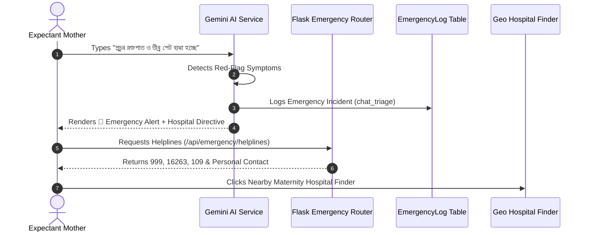

# Shokhi AI (সখী AI) — Emergency & Clinical Safety System Specification (Phase 10)

**Document Version:** 1.0.0  
**Phase:** Phase 10 — Emergency & Clinical Safety System  
**Date:** August 17, 2026  
**Status:** Implemented & Verified

---

## 1. Executive Summary & Capabilities

Phase 10 establishes a clinical safety subsystem within Shokhi AI. It protects the health of the mother and unborn child by detecting obstetric red flags in real-time, providing immediate emergency hotline routing, serving geo-intent hospital navigation links, and maintaining an audit log of all emergency events.

### Key Clinical Safety Capabilities:
1. **Obstetric Red-Flag Detection Interceptor:**
   * Continuously analyzes chat prompts for life-threatening obstetric conditions:
     - Heavy vaginal bleeding / hemorrhage ("রক্তক্ষরণ", "রক্তপাত", "heavy bleeding")
     - Acute severe abdominal pain ("তীব্র পেট ব্যথা", "severe abdominal pain")
     - Premature rupture of membranes / water breaking ("পানি ভাঙা", "water broke")
     - Maternal convulsions / eclamptic seizures ("খিঁচুনি", "seizures")
     - Cessation of fetal movement ("বাচ্চা নড়ছে না", "no movement")
     - Severe gestational hypertension symptoms (blurred vision, extreme headache)
2. **Emergency Advisory Injection (`🚨 **জরুরি সতর্কবার্তা:**`):**
   * Prepend high-visibility emergency directives advising immediate physical evaluation by a healthcare provider or hospital emergency room.
3. **National Emergency Helpline Integration:**
   * **999**: National Emergency Service (Police / Ambulance / Fire Service)
   * **16263**: Shastho Batayan (Government 24/7 Doctor Telemedicine)
   * **109**: National Women & Children Support Helpline
   * **333**: National Citizen & Government Services
4. **Personal Emergency Contact Direct Access:**
   * Synchronized from the mother's profile for 1-touch calling by attendants.
5. **Hospital Geo-Intent Search Generator:**
   * Generates location-aware mapping directives targeting nearby specialized maternity and obstetrics hospitals.
6. **Emergency Incident Logging (`emergency_logs` table):**
   * Persists all automated and manual SOS incidents for clinical review and defense auditing.

---

## 2. Emergency Subsystem Architecture

---

## 3. Endpoints Catalog

| Endpoint | Method | Access | Request Body | Description |
| :--- | :--- | :--- | :--- | :--- |
| `/api/emergency/helplines` | `GET` | Bearer Token | None | Returns verified 24/7 national hotlines and the mother's personalized emergency contact. |
| `/api/emergency/log` | `POST` | Bearer Token | `{trigger_source, symptom_detected, action_taken?}` | Records emergency events and clinical triage alerts into `emergency_logs`. |
| `/api/emergency/hospital_search` | `GET` | Public | `?q=search_query` | Generates location-based hospital locator URLs. |

---

## 4. Automated Verification Results (`test_phase10.py`)

All Phase 10 scenarios passed:
* **Chat Red-Flag Detection:** Status 200 (Triggered `🚨 **জরুরি সতর্কবার্তা:**` and persisted to `emergency_logs`).
* **Emergency Helplines:** Status 200 (Verified 999, 16263, 109, and personal contact integration).
* **Manual SOS Incident Logging:** Status 201 (`log_id` generated).
* **Hospital Geo-Search:** Status 200 (Verified Google Maps locator target).
* **Clinical Disclaimers:** Verified on all clinical output streams.

---

**Phase 10 Execution Finished.**
