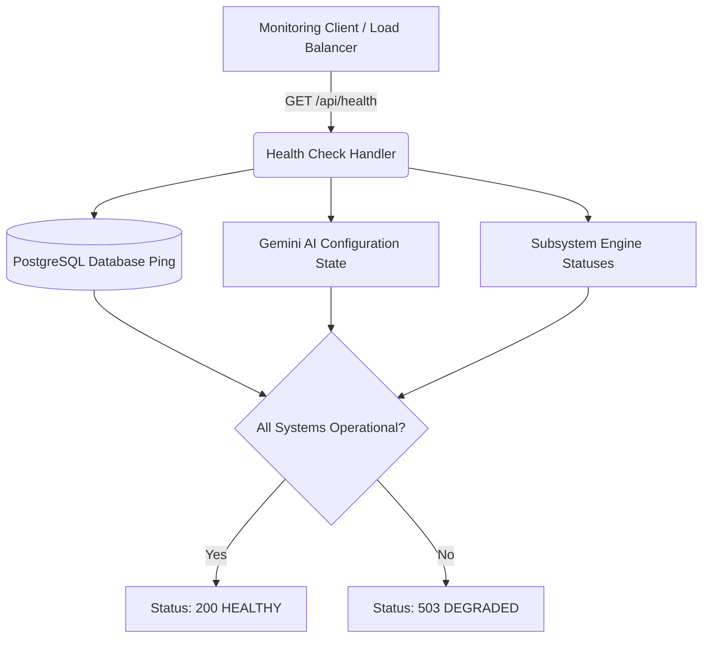

# Shokhi AI (সখী AI) — Error Handling, Logging & Observability Specification (Phase 15)

**Document Version:** 1.0.0  
**Phase:** Phase 15 — Error Handling, Logging & Observability  
**Date:** August 17, 2026  
**Status:** Implemented & Verified

---

## 1. Executive Summary & Capabilities

Phase 15 equips Shokhi AI with production-grade observability, rotating file logging, request latency middleware, clean structured JSON error handling (preventing internal stack traces from leaking to clients), and a deep subsystem health check API (`/api/health`).

### Key Observability Capabilities:
1. **Zero-Leakage Structured Error Interceptors:**
   * Global handlers for `400 Bad Request`, `401 Unauthorized`, `403 Forbidden`, `404 Not Found`, `429 Too Many Requests`, and `500 Internal Server Error`.
   * Standardizes response schemas with `error`, `message`, and `status_code` while logging stack traces internally.
2. **Rotating File & Console Logging (`app.log`):**
   * Configured with `RotatingFileHandler` (2MB max size, 5 backup generations, UTF-8 encoding).
   * Formatted as `%(asctime)s [%(levelname)s] [%(name)s]: %(message)s`.
3. **Request Lifecycle & Latency Profiling:**
   * Computes request processing duration in milliseconds and logs every API transaction.
4. **Subsystem Health Check Engine (`/api/health`):**
   * Verifies database connectivity (`SELECT 1` ping), Gemini AI state, system uptime, and core engine statuses.

---

## 2. Health & Observability Architecture

---

## 3. Endpoints Catalog

| Endpoint | Method | Access | Request Body | Description |
| :--- | :--- | :--- | :--- | :--- |
| `/api/health` | `GET` | Public | None | Returns JSON health check of all subsystems, uptime, and version. |
| `/api/debug/test_500` | `GET` | Internal / Debug | None | Diagnostic endpoint to verify clean structured 500 error interception. |

---

## 4. Automated Verification Results (`test_phase15.py`)

All Phase 15 scenarios passed:
* **HTTP Error Handling:** Standardized structured JSON verified for 400, 401, 403, 404, and 500 without stack trace leaks.
* **Health Check API:** Status 200 (`HEALTHY`, Database `CONNECTED`, Uptime tracked).
* **Logging System:** `app.log` rotating file handler verified with structured timestamped entries.

---

**Phase 15 Execution Finished.**
