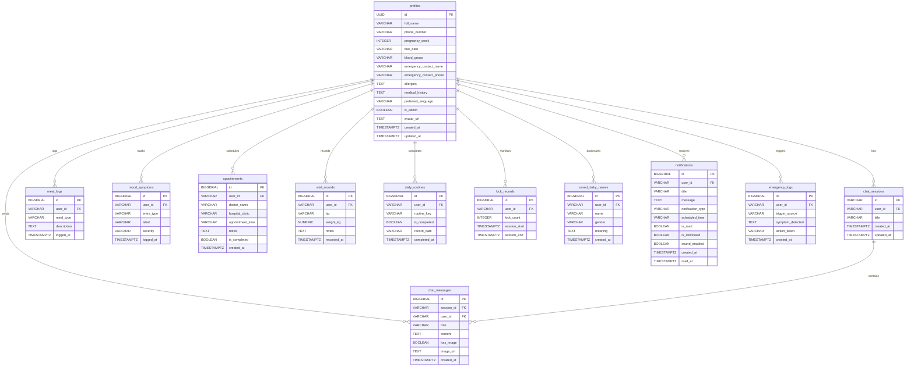

# Shokhi AI — Database ER Diagram

**Database:** Supabase PostgreSQL | **Tables:** 12 | **Security:** Row Level Security (RLS) enabled on all tables

---

## Entity Relationship Diagram



---

## Table Descriptions

| Table | Primary Key | Foreign Keys | Purpose |
|---|---|---|---|
| `profiles` | `id` (UUID, refs auth.users) | — | User accounts + pregnancy metadata |
| `chat_sessions` | `id` (VARCHAR) | `user_id` | Conversation sessions |
| `chat_messages` | `id` (BIGSERIAL) | `session_id`, `user_id` | Individual AI chat messages |
| `meal_logs` | `id` (BIGSERIAL) | `user_id` | Daily nutrition tracking |
| `mood_symptoms` | `id` (BIGSERIAL) | `user_id` | Mood & symptom entries |
| `appointments` | `id` (BIGSERIAL) | `user_id` | Doctor/clinic appointments |
| `vital_records` | `id` (BIGSERIAL) | `user_id` | Blood pressure & weight logs |
| `daily_routines` | `id` (BIGSERIAL) | `user_id` | Daily checklist (unique per user+key+date) |
| `kick_records` | `id` (BIGSERIAL) | `user_id` | Fetal kick monitoring sessions |
| `saved_baby_names` | `id` (BIGSERIAL) | `user_id` | Bookmarked baby names |
| `notifications` | `id` (BIGSERIAL) | `user_id` | Smart care alert notifications |
| `emergency_logs` | `id` (BIGSERIAL) | `user_id` | Emergency triage audit trail |

---

## Constraints & Indexes

### Unique Constraints
| Table | Constraint |
|---|---|
| `daily_routines` | `UNIQUE (user_id, routine_key, record_date)` — prevents duplicate entries per day |

### Check Constraints
| Table | Column | Constraint |
|---|---|---|
| `profiles` | `pregnancy_week` | `BETWEEN 1 AND 45` |
| `profiles` | `preferred_language` | `IN ('bn', 'en')` |
| `mood_symptoms` | `entry_type` | `IN ('mood', 'symptom')` |
| `mood_symptoms` | `severity` | `IN ('mild', 'moderate', 'severe')` |
| `chat_messages` | `role` | `IN ('user', 'assistant', 'system')` |
| `saved_baby_names` | `gender` | `IN ('boy', 'girl', 'unspecified')` |
| `kick_records` | `kick_count` | `>= 0` |

### Performance Indexes (12 total)
All indexes follow the pattern `(user_id, timestamp DESC)` for sub-10ms tenant-scoped queries:

```sql
idx_chat_sessions_user      ON chat_sessions(user_id, updated_at DESC)
idx_chat_messages_session   ON chat_messages(session_id, created_at ASC)
idx_chat_messages_user      ON chat_messages(user_id)
idx_meal_logs_user          ON meal_logs(user_id, logged_at DESC)
idx_mood_symptoms_user      ON mood_symptoms(user_id, logged_at DESC)
idx_appointments_user       ON appointments(user_id, created_at DESC)
idx_vital_records_user      ON vital_records(user_id, recorded_at DESC)
idx_daily_routines_user     ON daily_routines(user_id, record_date)
idx_kick_records_user       ON kick_records(user_id, session_start DESC)
idx_saved_baby_names_user   ON saved_baby_names(user_id)
idx_notifications_user      ON notifications(user_id, created_at DESC)
idx_emergency_logs_user     ON emergency_logs(user_id, created_at DESC)
```

---

## Row Level Security (RLS)

RLS is **enabled on all 12 tables**. Each table has a policy:

```sql
-- profiles: only own row
CREATE POLICY "Users can manage own profile" ON profiles
  FOR ALL USING (auth.uid() = id);

-- all other tables: own rows + broadcast rows (user_id = 'all')
CREATE POLICY "User access policy for <table>" ON <table>
  FOR ALL USING (auth.uid()::text = user_id OR user_id = 'all');
```

**Admin bypass:** The service role key (`SUPABASE_SERVICE_ROLE_KEY`) skips RLS entirely. Used only in `api/admin/metrics.js`, `api/admin/assign_role.js`, and `api/admin/delete.js` via `getSupabaseAdminClient()`.
