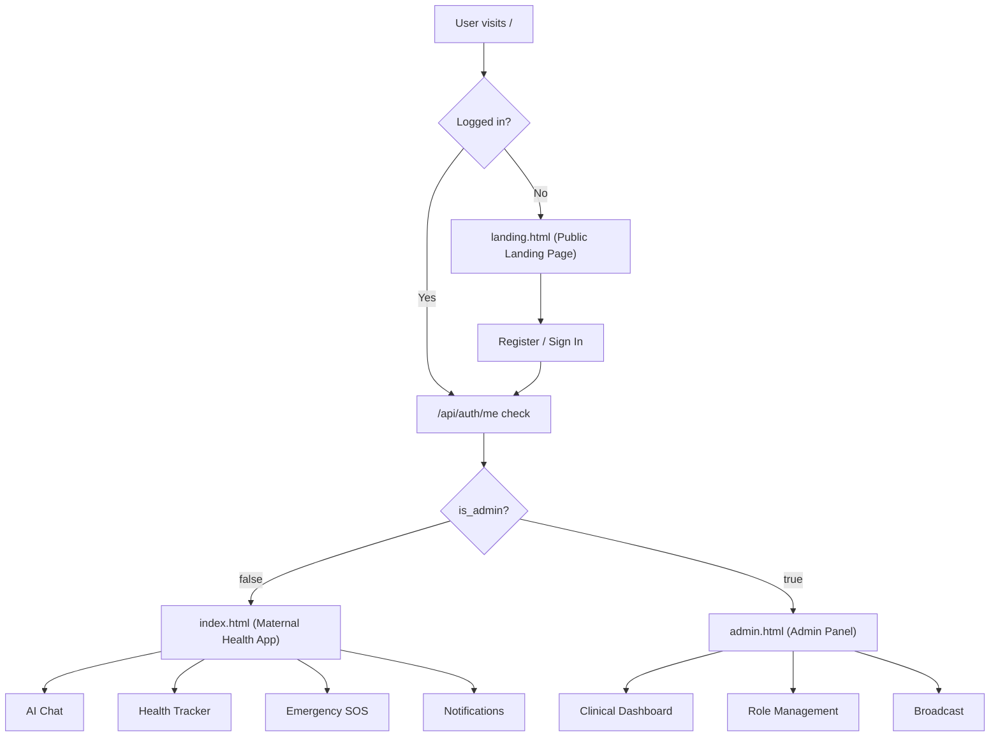

# Shokhi AI — Frontend Architecture Guide

**Version:** 2.0.0 | **Stack:** Vanilla HTML5 + CSS3 + JavaScript (ES6+)
**Pages:** 3 (`landing.html`, `index.html`, `admin.html`)

---

## 1. Page Structure Overview



---

## 2. Page Descriptions

### `landing.html` — Public Landing Page (139 KB)
The marketing and onboarding page. No authentication required.

**Sections:**
- Hero with CTA (Register / Sign In)
- Feature highlights
- Bilingual demo (Bengali + English)
- About Shokhi AI
- Registration modal
- Login modal (Google OAuth + email/password)

**Key JavaScript:**
- `handleGoogleSignIn()` — calls Supabase Auth `signInWithOAuth({ provider: 'google' })`
- `handleRegister()` → `POST /api/auth/register`
- `handleLogin()` → `POST /api/auth/login`
- On successful auth → calls `/api/auth/me` → routes to `index.html` or `admin.html`

---

### `index.html` — Maternal Health Application (159 KB)
The full maternal health dashboard. Requires authentication.

**Sections / Panels:**

| Section | Description |
|---|---|
| Sidebar Navigation | Links to all panels + notifications badge |
| AI Chat Panel | Multi-session bilingual chat with Shokhi AI |
| Health Overview | Gestational week, trimester, due-date countdown |
| Kick Counter | Tap counter + session timer |
| Meal Logger | Log breakfast/lunch/dinner/snack |
| Mood & Symptoms | Log mood or symptom with severity |
| Vitals Monitor | Log BP + weight readings |
| Daily Routines | Checklist of daily healthy habits |
| Appointments | Schedule + list doctor appointments |
| Hydration Tracker | Glass counter (8 glasses/day goal) |
| Baby Names | Search and bookmark baby names |
| Emergency SOS | One-tap helplines + GPS hospital map |
| Week Hub | Interactive gestational week timeline |
| Profile Settings | Update pregnancy info + emergency contact |
| Voice & TTS | Audio playback of AI responses |
| Image Upload | Sonogram/prescription photo analysis |
| Notifications | Notification list with read/dismiss |

---

### `admin.html` — Admin Panel (52 KB)
Real-time clinical dashboard. Requires `is_admin = true`. See [`ADMIN_PANEL_GUIDE.md`](./ADMIN_PANEL_GUIDE.md) for full details.

---

## 3. Authentication Flow (Frontend)

### Token Storage
```js
// Normal user
localStorage.setItem('shokhi_auth_token', token);

// Admin user
localStorage.setItem('shokhi_admin_token', token);
```

### Startup Auth Check (`index.html`)
```js
async function checkAuthStatus() {
  const token = localStorage.getItem('shokhi_auth_token');
  if (!token) {
    showLoginScreen(); return;
  }

  const res = await fetch('/api/auth/me', {
    headers: { Authorization: `Bearer ${token}` }
  });

  if (!res.ok) {
    localStorage.removeItem('shokhi_auth_token');
    showLoginScreen(); return;
  }

  const user = await res.json();
  window.currentUser = user;

  if (user.is_admin) {
    // Admin users redirect to admin panel
    window.location.href = '/admin.html';
  } else {
    showMainApp(user);
    loadDashboard();
  }
}
```

### Google OAuth Flow
```js
// 1. User clicks "Continue with Google"
await supabase.auth.signInWithOAuth({ provider: 'google' });

// 2. Supabase redirects back with session
const { data: { session } } = await supabase.auth.getSession();

// 3. Sync to profiles table
await fetch('/api/auth/google', {
  method: 'POST',
  body: JSON.stringify({ email: session.user.email, name: session.user.user_metadata.full_name })
});

// 4. Route based on role
```

---

## 4. API Communication Pattern

All authenticated API calls follow this pattern:

```js
const token = localStorage.getItem('shokhi_auth_token');

const response = await fetch('/api/maternity/meals', {
  method: 'POST',
  headers: {
    'Content-Type': 'application/json',
    'Authorization': `Bearer ${token}`
  },
  body: JSON.stringify({ meal_type: 'lunch', description: 'ভাত, ডাল' })
});

const data = await response.json();
```

---

## 5. Supabase Realtime (Admin Panel Only)

The admin panel initializes Supabase from the public config endpoint:

```js
// Fetch public Supabase config from server
const configRes = await fetch('/api/config');
const { supabase_url, supabase_anon_key } = await configRes.json();

// Initialize Supabase client
const supabase = window.supabase.createClient(supabase_url, supabase_anon_key);

// Subscribe to changes on all clinical tables
supabase.channel('admin-realtime')
  .on('postgres_changes', { event: '*', schema: 'public', table: 'chat_messages' }, onDataChange)
  .on('postgres_changes', { event: '*', schema: 'public', table: 'meal_logs' }, onDataChange)
  // ... 6 more tables
  .subscribe((status) => updateLiveBadge(status));
```

`supabase.min.js` is bundled locally in `www/supabase.min.js` (207 KB) — no CDN dependency.

---

## 6. Key Frontend Files

| File | Size | Purpose |
|---|---|---|
| `www/landing.html` | 139 KB | Public onboarding + auth forms |
| `www/index.html` | 159 KB | Full maternal health app (all panels inline) |
| `www/admin.html` | 52 KB | Admin dashboard |
| `www/main.js` | 28 KB | Shared JS utilities (loaded by index.html) |
| `www/style.css` | 4 KB | Global CSS variables and base styles |
| `www/supabase.min.js` | 207 KB | Supabase JS SDK (Realtime + Auth) |
| `www/assets/maternal_hero.png` | 858 KB | Hero image for landing page |
| `www/assets/audio/` | ~280 KB | UI sound effects (click, countdown) |

---

## 7. Language Switching

The app supports **Bengali (default)** and **English** modes.

```js
// Stored in localStorage
localStorage.setItem('shokhi_language', 'bn'); // or 'en'

// Sent with every chat request
{ language: localStorage.getItem('shokhi_language') || 'bn' }
```

Gemini receives the language param and switches between the Bengali "সখী আপু" persona and the English "Shokhi" persona via `getSystemInstruction(language)` in `lib/gemini.js`.

---

## 8. Notification Polling

The maternal app polls for new notifications every 30 seconds:

```js
async function pollNotifications() {
  const res = await fetch('/api/notifications', { headers: { Authorization: `Bearer ${token}` } });
  const { notifications, unread_count } = await res.json();

  updateNotificationBadge(unread_count);

  if (unread_count > 0) {
    showToastNotification(notifications[0]);
    playAlertSound();
  }
}

setInterval(pollNotifications, 30000);
```

---

## 9. Emergency SOS Module

When an emergency is detected in chat (or user taps SOS button):

```js
function showEmergencySOS(helplines) {
  document.getElementById('sos-modal').style.display = 'flex';

  // Render call buttons for each helpline
  helplines.forEach(h => {
    addCallButton(h.name, h.number);
  });

  // GPS hospital search
  const mapLink = `https://maps.google.com/?q=hospital+near+me`;
  document.getElementById('hospital-map-link').href = mapLink;
}
```

Helplines always displayed: **999**, **16263**, **109**, **333** + personal emergency contact from user profile.
