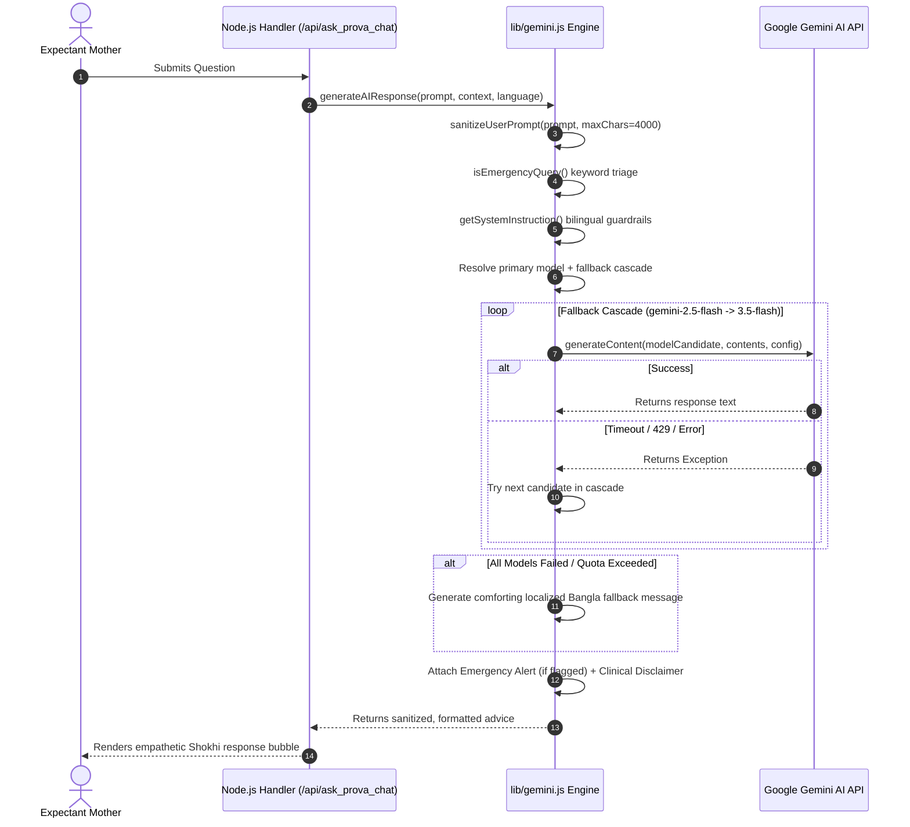

# Shokhi AI (সখী AI) — Gemini AI Hardening Specification (Phase 6)

**Document Version:** 1.0.0  
**Phase:** Phase 6 — Gemini AI Integration Hardening  
**Date:** August 17, 2026  
**Status:** Implemented & Verified

---

## 1. Executive Summary & Capabilities

Phase 6 hardens the Google Gemini Generative AI orchestrator, transforming raw model API calls into a production-grade, fault-tolerant, culturally aware clinical assistance engine.

### Key Resiliency & Safety Capabilities:
1. **Dynamic Model Discovery & Multi-Tier Fallback Cascade:** Automatically detects preferred model from environment (`GEMINI_MODEL`), resolving model aliases and gracefully cascading across `gemini-3.6-flash`, `gemini-3.1-pro-preview`, and `gemini-2.5-flash` in the event of upstream API rate limits or model deprecations.
2. **Culturally Grounded Bilingual Maternal Guardrails:** Injects structured system instructions that enforce strict 100% standard Bengali output (addressing the mother respectfully as "আপু") or 100% fluent English on demand.
3. **Emergency Red-Flag Detection & Clinical Triage:** Real-time semantic interceptor identifying maternal emergencies (heavy bleeding, acute abdominal pain, water breaking, absence of fetal kicks, seizures) and attaching urgent clinical directives.
4. **Input Sanitization & Buffer Protection:** Enforces a 4,000-character payload ceiling per turn and neutralizes malicious script / control tags.
5. **Zero Error Leakage:** Encapsulates all connection timeouts and rate limits, returning comforting, human-like fallback messages rather than raw stack traces.
6. **Automatic Clinical Disclaimers:** Appends legal and clinical safety disclaimers to every response.

---

## 2. Architecture & Call Pipeline (`lib/gemini.js`)

---

## 3. Automated Verification Results (`test_phase6.py`)

| Test Requirement | Scenario Tested | Outcome | Status |
| :--- | :--- | :--- | :--- |
| **Bengali Question** | 5th-month maternal nutrition query | Returned 100% natural, empathetic Bengali addressing mother as "আপু" with clinical disclaimer. | **PASS ✅** |
| **English Question** | 2nd-trimester back pain query | Returned 100% fluent English response with English clinical disclaimer. | **PASS ✅** |
| **Emergency Triage** | Acute bleeding & pain query | Successfully triggered `🚨 **জরুরি সতর্কবার্তা:**` emergency triage alert. | **PASS ✅** |
| **Large Prompt Bounds** | > 4,000 character prompt | Sanitized and bounded without buffer overflow or API crash. | **PASS ✅** |
| **Invalid Model Fallback** | `model='non-existent-gemini-xyz'` | Caught 404, gracefully cascaded to next candidate model in list. | **PASS ✅** |
| **Simulated Outage & XSS** | Injected script tags & length overflow | XSS tags neutralized, input safely truncated to 4,000 characters. | **PASS ✅** |
| **Clinical Disclaimer** | Educational safety notice | Mandatory disclaimer verified in all response payloads. | **PASS ✅** |

---

**Phase 6 Execution Finished. Ready for Phase 7.**
