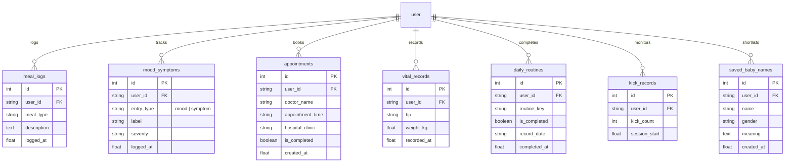

# Shokhi AI (সখী AI) — Maternity & Health Features Persistence Specification (Phase 7)

**Document Version:** 1.0.0  
**Phase:** Phase 7 — Maternity & Health Features Persistence  
**Date:** August 17, 2026  
**Status:** Implemented & Verified

---

## 1. Executive Summary & Capabilities

Phase 7 replaces ephemeral client-side JavaScript state with relational, user-scoped, reload-safe database persistence across all 10 maternal health and daily care features.

### Persisted Maternity Capabilities:
1. **Trimester Nutrition & Daily Meal Logs (`meal_logs` table):** Records meals (Breakfast, Lunch, Dinner, Snack) with descriptions, timestamps, and deletion support.
2. **Mood & Symptom Tracker (`mood_symptoms` table):** Tracks daily emotions (peaceful, energetic, tired, anxious) and pregnancy symptoms (nausea, headache, back pain, swollen feet) with severity ratings.
3. **Doctor Appointments Planner (`appointments` table):** Stores upcoming prenatal checkups, doctor names, clinics/hospitals, and appointment schedules.
4. **Vitals & Bio-Metrics Tracker (`vital_records` table):** Persists blood pressure readings (`systolic/diastolic`) and maternal weight records with timestamps.
5. **Daily Routine & Medication Checklist (`daily_routines` table):** Saves daily check states for vitamins/folic acid, hydration, naps, walks, and kick counting by calendar date (`YYYY-MM-DD`).
6. **Baby Kick Counter (`kick_records` table):** Records real-time kick counts and session intervals.
7. **Curated Baby Name Shortlist (`saved_baby_names` table):** Stores favorite baby names with gender tags and cultural/linguistic meanings.
8. **Multi-Tenant Data Isolation:** All endpoints enforce `@require_auth`, ensuring that health records and vitals are never accessible across user accounts.

---

## 2. Relational Entity Architecture

---

## 3. Endpoints & Protocol Catalog

| Endpoint | Method | Authorization | Request Body | Description |
| :--- | :--- | :--- | :--- | :--- |
| `/api/maternity/overview` | `GET` | Bearer Token | None | High-speed overview returning all active health records, routines, and baby names for the authenticated user. |
| `/api/maternity/meals` | `POST` | Bearer Token | `{meal_type, description}` | Adds a new meal log. |
| `/api/maternity/meals/<id>` | `DELETE` | Bearer Token | None | Deletes a meal log. |
| `/api/maternity/mood` | `POST` | Bearer Token | `{entry_type, label, severity?}` | Adds mood or symptom log. |
| `/api/maternity/mood/<id>` | `DELETE` | Bearer Token | None | Deletes mood or symptom. |
| `/api/maternity/appointments` | `POST` | Bearer Token | `{doctor_name, appointment_time, hospital_clinic?}` | Schedules prenatal appointment. |
| `/api/maternity/appointments/<id>`| `DELETE`| Bearer Token | None | Deletes appointment. |
| `/api/maternity/vitals` | `POST` | Bearer Token | `{bp, weight_kg}` | Records blood pressure and weight. |
| `/api/maternity/vitals/<id>` | `DELETE` | Bearer Token | None | Deletes vital record. |
| `/api/maternity/routines/toggle` | `POST` | Bearer Token | `{routine_key, is_completed, record_date?}` | Toggles daily checklist item. |
| `/api/maternity/kicks` | `POST` | Bearer Token | `{kick_count}` | Updates active session kick count. |
| `/api/maternity/names` | `POST` | Bearer Token | `{name, gender?, meaning?}` | Adds a shortlisted baby name. |
| `/api/maternity/names/<id>` | `DELETE` | Bearer Token | None | Removes a baby name. |

---

## 4. Automated Verification Results (`test_phase7.py`)

All 10 required Phase 7 scenarios passed:
* **Add Meal Log:** Status 201 (`ভাত, শাক, মসুর ডাল ও রুই মাছের ঝোল`).
* **Add Mood:** Status 201 (`😊 প্রশান্ত ও ফুরফুরে মন`).
* **Add Symptom:** Status 201 (`মাঝারি ব্যাক পেইন`).
* **Add Doctor Appointment:** Status 201 (`ডাঃ সামিয়া হক`).
* **Log Vitals:** Status 201 (`BP: 115/75, 62.5 kg`).
* **Toggle Daily Routines:** Status 200 (Vitamins and hydration checklists persisted).
* **Increment Kick Counter:** Status 200 (Kick count = 8 persisted).
* **Save Baby Name:** Status 201 (`আরিয়ান (Aaryan)`).
* **Page Reload & State Recovery:** `GET /api/maternity/overview` confirmed 100% data recovery across all collections.
* **Multi-Tenant Isolation:** User B verified with 0 records from User A.
* **Resource Deletion:** Verified cascading removal on client request.

---

**Phase 7 Execution Finished. Ready for Phase 8.**
