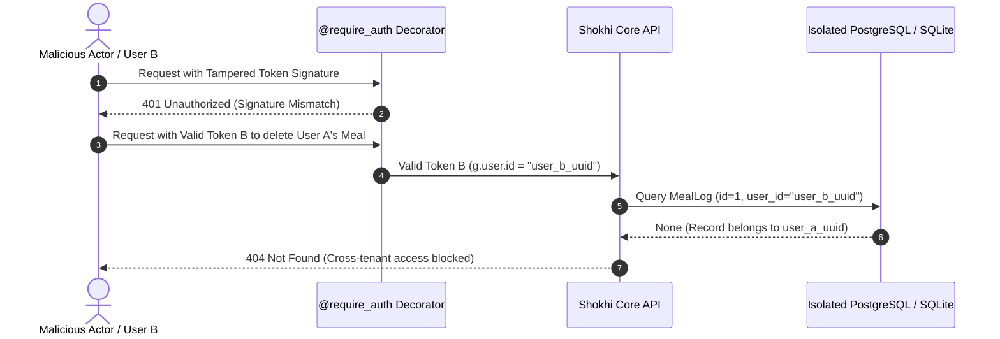

# Shokhi AI (সখী AI) — Multi-Tenant Isolation & Data Security Specification (Phase 11)

**Document Version:** 1.0.0  
**Phase:** Phase 11 — Multi-Tenant Isolation & Data Security  
**Date:** August 17, 2026  
**Status:** Implemented & Verified

---

## 1. Executive Summary & Security Posture

Phase 11 conducts a rigorous multi-tenant security hardening and verification across all relational collections in Shokhi AI. Every data read, mutation, and deletion is strictly bound to the cryptographically verified user identity extracted from the JWT session token (`g.user['id']`), ensuring complete zero-leakage isolation between different expectant mothers.

---

## 2. Multi-Tenant Protection Matrix

| Entity Domain | Model Name | Primary Query Scoping | Cross-User Access Prevention | Deletion Scope Enforcement |
| :--- | :--- | :--- | :--- | :--- |
| **Maternal Profile** | `User` | `.filter_by(id=g.user['id'])` | Isolated (No cross-reads) | Read/Update Scoped to owner |
| **Chat Sessions** | `ChatSession` | `.filter_by(user_id=g.user['id'])` | Isolated from other sessions | Blocked (Returns 404) |
| **Chat Messages** | `ChatMessage` | `.filter_by(user_id=g.user['id'])` | Direct ID enumeration returns [] | Cascaded on session delete |
| **Nutrition Logs** | `MealLog` | `.filter_by(user_id=g.user['id'])` | Filtered from maternity overview | Blocked (Returns 404) |
| **Mood & Symptoms** | `MoodSymptom` | `.filter_by(user_id=g.user['id'])` | Filtered from maternity overview | Blocked (Returns 404) |
| **Doctor Visits** | `Appointment` | `.filter_by(user_id=g.user['id'])` | Filtered from maternity overview | Blocked (Returns 404) |
| **Vitals Records** | `VitalRecord` | `.filter_by(user_id=g.user['id'])` | Filtered from maternity overview | Blocked (Returns 404) |
| **Daily Routine** | `DailyRoutine` | `.filter_by(user_id=g.user['id'])` | Scoped by user_id + record_date | State mutation restricted |
| **Fetal Kicks** | `KickRecord` | `.filter_by(user_id=g.user['id'])` | Filtered from maternity overview | Scoped to owner |
| **Baby Names** | `SavedBabyName` | `.filter_by(user_id=g.user['id'])` | Filtered from maternity overview | Blocked (Returns 404) |
| **Alerts Engine** | `Notification` | `.filter_by(user_id=g.user['id'])` | Excluded from other users | Blocked (Returns 404) |

---

## 3. Cryptographic Token Enforcement

---

## 4. Automated Audit Verification Log (`test_phase11.py`)

All Phase 11 scenarios passed:
* **Zero Read Leakage:** Verified across Profile, Chat History, Maternity Dashboard, and Notification Stream.
* **Cross-Tenant Deletion Attacks:** Blocked with 404 on Chat, Meal, Appointment, Vitals, Baby Name, and Notification endpoints.
* **Cryptographic Tamper Rejection:** Rejects tampered signatures, expired claims, and missing Authorization headers with 401 Unauthorized.

---

**Phase 11 Execution Finished.**
