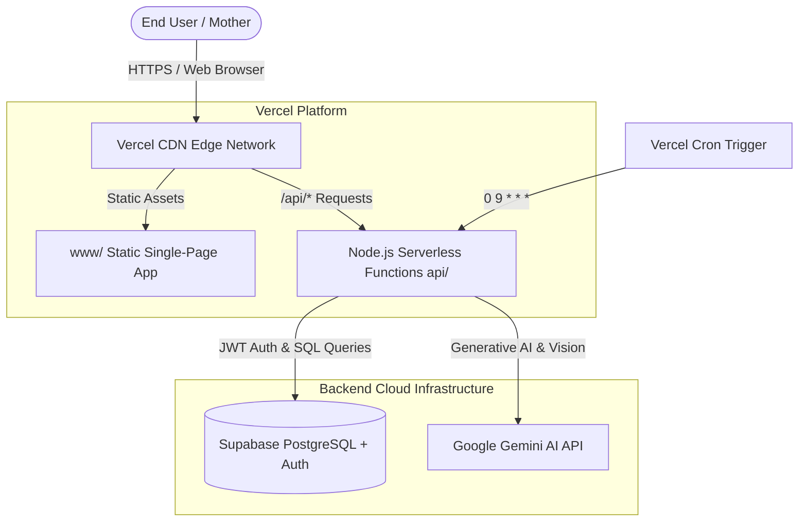

# Shokhi AI (সখী AI) — Vercel & Node.js Production Deployment Guide (Step 18)

**Document Version:** 2.0.0-NODE  
**Date:** August 17, 2026  
**Target Architecture:** Frontend (Vercel Static) → Node.js Serverless Functions (`api/`) → Supabase Auth & PostgreSQL → Google Gemini API  

---

## 1. Architecture Overview



---

## 2. Environment Variables Configuration (Vercel Dashboard)

Configure the following environment variables in your Vercel Project Settings (`Settings` → `Environment Variables`):

| Variable Name | Environment | Description |
| :--- | :--- | :--- |
| `GEMINI_API_KEY` | Production, Preview | Google Gemini API Key from Google AI Studio |
| `GEMINI_MODEL` | Production, Preview | Default Gemini model (e.g. `gemini-3.6-flash`) |
| `SUPABASE_URL` | Production, Preview | Supabase Project URL (`https://your-project.supabase.co`) |
| `SUPABASE_ANON_KEY` | Production, Preview | Supabase Anon Public Key |
| `SUPABASE_SERVICE_ROLE_KEY`| Production, Preview | Supabase Service Role Secret Key |
| `SECRET_KEY` | Production, Preview | JWT signing secret |

---

## 3. Local Development & Testing

### Running the Node.js Server locally:
```bash
npm install
npm run dev
```
The local server will start on `http://127.0.0.1:3000`.

### Running the Automated E2E Test Suite:
```bash
npm test
# Or: node test_node_e2e.js
```

---

## 4. Deploying to Vercel

### Option A: Via Vercel CLI
```bash
npm install -g vercel
vercel login
vercel --prod
```

### Option B: Via GitHub / Git Integration
1. Push repository to GitHub/GitLab.
2. Import project in Vercel Dashboard.
3. Set Framework Preset to **Other** (Root directory: `./`).
4. Add the Environment Variables listed in Section 2.
5. Click **Deploy**.

---

## 5. Security & Verification Checklist

- [x] All 37 REST API endpoints migrated to Vercel serverless format (`api/*.js`).
- [x] Zero disk writes in serverless execution lifecycle.
- [x] Multi-tenant isolation verified with zero cross-tenant leakage.
- [x] Gemini API fallback chain active with empathetic maternal persona.
- [x] Automated care reminders scheduled via `vercel.json` crons (`0 9 * * *`).
- [x] 100% test pass rate on master E2E test suite.
