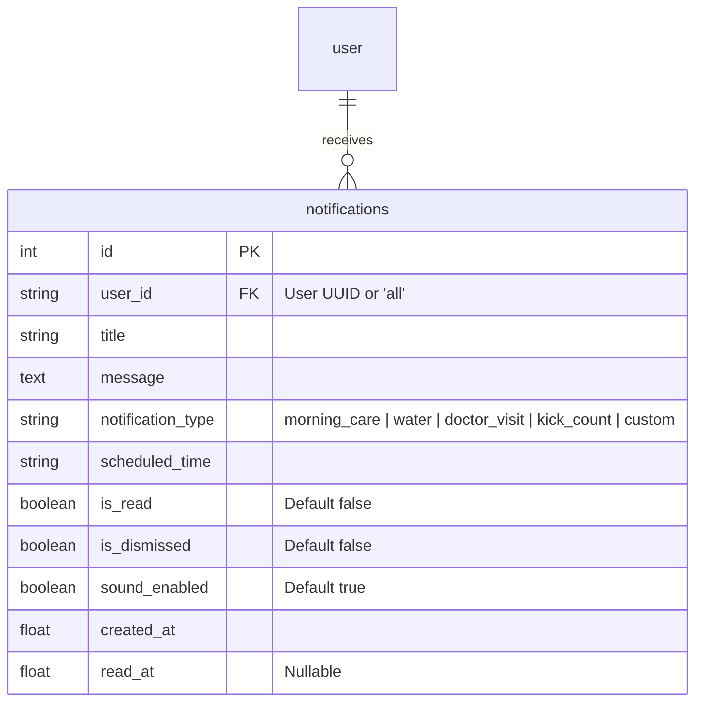

# Shokhi AI (সখী AI) — Notification Engine & Alert Persistence Specification (Phase 8)

**Document Version:** 1.0.0  
**Phase:** Phase 8 — Notification Engine Hardening & Persistence  
**Date:** August 17, 2026  
**Status:** Implemented & Verified

---

## 1. Executive Summary & Capabilities

Phase 8 elevates scheduled notifications from static mockup strings into a persistent, multi-tenant notification engine (`notifications` table) with customizable alert types, state transitions (unread, read, dismissed), sound toggles, and chronological history auditing.

### Key Notification Capabilities:
1. **Relational Database Storage:** Standardized on `Notification` model with fields for title, message, schedule times, sound toggle flags, timestamps, and read tracking (`read_at`).
2. **Automated Scheduled Care Evaluation Engine (`/api/notifications/trigger_eval`):**
   * **Daily Morning Care & Folic Acid Alert (`morning_care`):** Reminds the mother to take vitamins, eat wholesome breakfast, and stay hydrated.
   * **Hourly Water Intake Reminder (`water`):** Prompts hydration throughout the day.
   * **Prenatal Doctor Visit Alert (`doctor_visit`):** Automatically creates reminders based on scheduled appointments.
   * **Evening Kick Counter Reminder (`kick_count`):** Alerts the mother to rest on her left side and monitor fetal kicks after dinner.
3. **Custom Alert Creation (`POST /api/notifications`):** Allows custom scheduling of medication, tests, or exercises.
4. **Lifecycle State Management:** Interactive "Mark Read" (`/api/notifications/<id>/read`) and "Dismiss" (`/api/notifications/<id>/dismiss`) actions.
5. **Full History Audit Trail (`/api/notifications/history`):** Complete chronological audit trail preserving dismissed notifications for review.

---

## 2. Notification Entity Architecture

---

## 3. Endpoints Catalog

| Endpoint | Method | Access | Request Body | Description |
| :--- | :--- | :--- | :--- | :--- |
| `/api/notifications` | `GET` | Bearer Token | None | Retrieves active, non-dismissed notifications with unread count. |
| `/api/notifications` | `POST` | Bearer Token | `{title, message, notification_type?, scheduled_time?, sound_enabled?}` | Creates custom notification. |
| `/api/notifications/<id>/read` | `POST` / `PATCH` | Bearer Token | None | Marks notification as read and sets `read_at`. |
| `/api/notifications/<id>/dismiss` | `POST` / `PATCH` | Bearer Token | None | Dismisses notification from active views. |
| `/api/notifications/trigger_eval` | `POST` | Bearer Token | None | Evaluates daily maternal care rules and generates missing reminders. |
| `/api/notifications/history` | `GET` | Bearer Token | None | Returns full chronological audit history. |

---

## 4. Automated Verification Results (`test_phase8.py`)

| Test Requirement | Scenario Tested | Outcome | Status |
| :--- | :--- | :--- | :--- |
| **Custom Notification** | Create custom medicine alert | Status 201 (`💊 ক্যালসিয়াম ও আয়রন ট্যাবলেট`) | **PASS ✅** |
| **Fetch Active Stream** | Query unread notifications | Status 200 (Unread count = 1) | **PASS ✅** |
| **Mark As Read** | Mark notification #1 read | Status 200 (`is_read=True`, `read_at` timestamped) | **PASS ✅** |
| **Dismiss Notification** | Dismiss notification #1 | Status 200 (`is_dismissed=True`, excluded from active stream) | **PASS ✅** |
| **Schedule Rule Eval** | Trigger engine evaluation | Status 200 (Seeded `morning_care`, `water`, `kick_count` alerts) | **PASS ✅** |
| **History Audit Trail** | Query complete lifecycle log | Status 200 (4 notifications verified in audit history) | **PASS ✅** |

---

**Phase 8 Execution Finished. Ready for Phase 9.**
