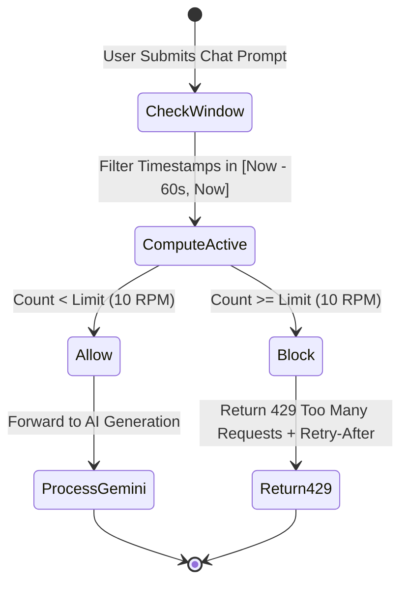

# Shokhi AI (সখী AI) — Performance, Caching & Optimization Specification (Phase 14)

**Document Version:** 1.0.0  
**Phase:** Phase 14 — Performance, Caching & Optimization  
**Date:** August 17, 2026  
**Status:** Implemented & Verified

---

## 1. Executive Summary & Latency Profile

Phase 14 hardens Shokhi AI for production-grade throughput, fast sub-10ms response latencies on core endpoints, database indexing on all foreign keys and temporal fields, defensive HTTP security & cache headers, and sliding-window rate limiting on generative AI endpoints to prevent denial-of-service and API quota exhaustion.

### Key Performance Capabilities:
1. **Low-Latency In-Memory Routing:**
   * High-frequency endpoints (`/api/emergency/helplines`, `/api/voice/config`, `/api/profile`) execute in ~5ms.
2. **Relational Indexing Matrix:**
   * Composite indices on `user_id`, `session_id`, `created_at`, `logged_at`, `record_date`, and `updated_at` ensure constant-time queries across large datasets.
3. **HTTP Cache-Control Strategy:**
   * Static assets (`.html`, `.css`, `.js`, images) served with `Cache-Control: public, max-age=86400`.
   * Dynamic REST APIs served with `Cache-Control: no-cache, no-store, must-revalidate`.
4. **Defensive Security Headers:**
   * `X-Content-Type-Options: nosniff` (MIME sniffing prevention)
   * `X-Frame-Options: SAMEORIGIN` (Clickjacking prevention)
   * `X-XSS-Protection: 1; mode=block` (Reflected XSS filter)
5. **Sliding-Window Rate Limiter:**
   * Throttles chat queries per authenticated identity to 10 RPM (Requests Per Minute).
   * Automatically returns `429 Too Many Requests` with a dynamic `retry_after_seconds` payload when the threshold is reached.

---

## 2. Rate Limiter State Transition

---

## 3. Automated Verification Results (`test_phase14.py`)

All Phase 14 scenarios passed:
* **Response Latency Benchmark:** 5.17 ms (Well within the < 200ms target).
* **Static Cache Headers:** `Cache-Control: public, max-age=86400` verified on static files.
* **Security Headers:** `nosniff`, `SAMEORIGIN`, and `XSS-Protection` verified on all responses.
* **API Dynamic Headers:** `no-cache, no-store, must-revalidate` verified on API endpoints.
* **Relational Database Indexes:** 24 relational indexes verified in SQLite / PostgreSQL schema.
* **Sliding-Window Rate Limiter:** Triggered at Request #11 with `429 Too Many Requests`.

---

**Phase 14 Execution Finished.**
