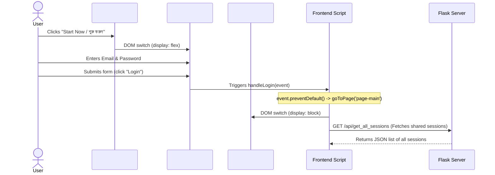
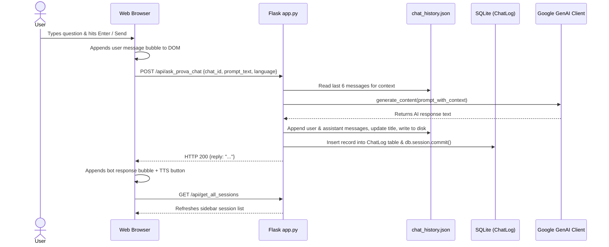
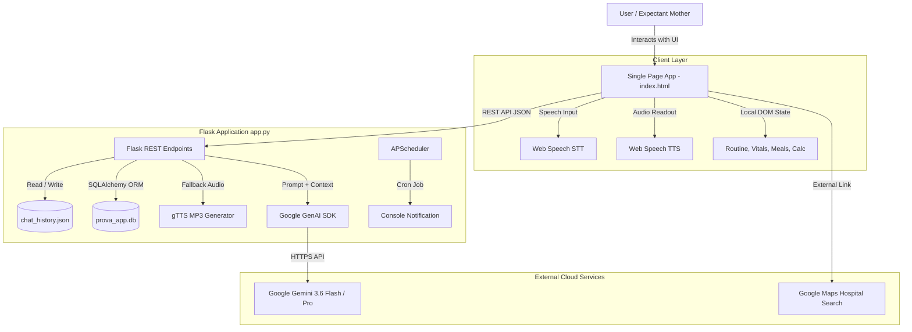

# Shokhi AI (সখী AI) — Comprehensive Project Audit (Phase 0)

**Document Version:** 1.0.0  
**Audit Date:** August 17, 2026  
**Auditor:** Lead Software Engineering Practicum Lead  
**Scope:** Full repository technical inspection without code modifications.

---

## 1. Complete Folder & File Structure

```
f:\downloads\Shokhi-AI-main\Shokhi-AI-main/
│
├── .env                              # Active local environment variables & API keys
├── .env.example                      # Environment configuration template
├── .gitignore                        # Git ignore patterns (.env, __pycache__, etc.)
├── README.md                         # Project summary & basic tech list
├── requirements.txt                  # Python runtime package dependencies
├── app.py                            # Flask application, routing, scheduler, AI & persistence logic
├── chat_history.json                 # JSON flat-file storage for chat sessions and message logs
│
├── instance/
│   └── prova_app.db                  # Local SQLite database (User, ScheduledNotification, ChatLog)
│
├── docs/                             # Academic & engineering specification artifacts (Phase 0+)
│   └── PROJECT_AUDIT.md              # This project audit document
│
└── www/                              # Frontend static assets served by Flask
    ├── index.html                    # Single Page Application UI, markup, styles & event scripts
    ├── style.css                     # Design tokens, variables, glowing animations & buttons
    ├── main.js                       # Standalone JavaScript helper module
    └── assets/
        ├── audio/                    # Directory for audio assets / temporary voice files
        └── vendor/                   # Directory for third-party client-side libraries
```

---

## 2. Complete Technology Stack

| Tier / Component | Technology | Version / Specification | Role in System |
| :--- | :--- | :--- | :--- |
| **Backend Runtime** | Python | 3.12+ | Server-side execution environment |
| **Web Framework** | Flask | `>=3.0.0` | HTTP request routing, REST API dispatch, static serving |
| **CORS Middleware** | Flask-Cors | Latest | Cross-origin resource sharing policy handling |
| **ORM Layer** | Flask-SQLAlchemy | Latest | Object-Relational Mapping for SQLite database |
| **Admin Dashboard** | Flask-Admin | Latest | Administrative model view & database inspection interface |
| **Task Scheduling** | APScheduler | `BackgroundScheduler` | Periodic background cron execution (daily 09:00 AM notifications) |
| **LLM SDK** | Google GenAI SDK | `google-genai` & `google-generativeai` | Multi-turn prompt execution, content generation & model cascades |
| **Audio Processing** | gTTS | Latest | Google Text-to-Speech MP3 audio streaming fallback |
| **Configuration** | python-dotenv | Latest | `.env` parsing and environment variable injection |
| **Relational Database** | SQLite 3 | Embedded (`instance/prova_app.db`) | Relational entity storage (`User`, `ScheduledNotification`, `ChatLog`) |
| **Flat-File Store** | JSON | Standard Library (`chat_history.json`) | Primary session tree and message transcript store |
| **Client UI Architecture** | HTML5 / Vanilla CSS3 / ES6+ JS | Native SPA | Dynamic view transitions, glassmorphism UI, client state management |
| **Speech APIs** | Web Speech API | Native Browser APIs | `SpeechRecognition` (voice input), `SpeechSynthesis` (audio readout) |
| **Design / Typography** | Google Fonts & FontAwesome | Hind Siliguri, Outfit, Plus Jakarta Sans, FA 6.4 | Maternal typography, iconography, and responsive design tokens |

---

## 3. Frontend Architecture

### 3.1 Architecture Model
* **Type:** Single-Page Application (SPA) driven by Vanilla JavaScript and DOM manipulation.
* **Layout Pattern:** View container state switching with three distinct screen stages:
  1. `#page-welcome`: Language selection pill (Bengali/English) and application introduction card.
  2. `#page-login`: Authentication form (simulated email/password fields).
  3. `#page-main`: 3-Column responsive maternity workspace dashboard.

### 3.2 Dashboard Column Organization
* **Left Column (`.sidebar`, width: 280px):**
  * Brand badge and logout button.
  * "New Chat / নতুন চ্যাট" action button.
  * Chat session history list (`#historyList`) with dynamic active state highlighting.
  * Right-click context menu listener for chat deletion.
* **Center Column (`.chat-section`):**
  * Header with assistant online status indicator and runtime bilingual language switcher.
  * Scrollable message container (`#chatBox`) displaying conversational bubbles (user vs. assistant).
  * Inline voice playback trigger buttons (`.tts-btn`).
  * Floating capsule input bar with attachment upload, text field, microphone dictation button, and send action.
  * AI safety disclaimer footer.
* **Right Column (`.tools-section`, width: 360px):**
  * Daily inspirational quotes widget.
  * Daily routine checklist with persistent state tracking.
  * Due date & gestational age calculator based on Last Menstrual Period (LMP).
  * Trimester-based dietary recommendations tab (1st, 2nd, 3rd Trimester).
  * Daily meal and nutrition logger.
  * Mood and symptom tracker (Good, Tired, Nausea).
  * Doctor appointment booking and tracker.
  * Blood pressure (BP) and body weight tracker.
  * Hydration timer and baby kick counter.
  * Google Maps emergency hospital locator.
  * Baby name shortlist manager.

---

## 4. Backend Architecture

### 4.1 Server Lifecycle & Initialization
* Flask application instantiated with `app = Flask(__name__, static_folder='www', template_folder='www', static_url_path='')`.
* Root path (`/`) directly renders `www/index.html`.
* Automatic free-port detection starting from `os.getenv('FLASK_PORT', 5000)`. If port 5000 is occupied or in socket `TIME_WAIT`, it automatically attempts sequential ports (`5001+`) and binds cleanly without crash.
* Debug mode enabled with `use_reloader=False` in production-safe runs.

### 4.2 Application State & Persistence Dual-Layer
1. **File-Based JSON Layer (`chat_history.json`):**
   * Acts as the primary query source for session listings (`/api/get_all_sessions`) and message threads (`/api/get_chat_messages/<id>`).
   * Structure contains a map of UUID-based `chat_id` objects with `title`, `timestamp`, and an array of `messages` (`role`, `content`).
2. **Relational Database Layer (`instance/prova_app.db` via SQLAlchemy):**
   * Mirrors interactions into the `ChatLog` table (`chat_id`, `user_message`, `bot_response`, `timestamp`).
   * Managed by Flask-Admin views at `/admin`.

### 4.3 Background Scheduler
* Implements `APScheduler.BackgroundScheduler` running a cron job daily at `09:00 AM`.
* Executes `send_daily_reminder()` in the background (currently logs a maternal reminder message to server standard output).

---

## 5. Database Architecture

* **Database Engine:** SQLite 3 (`instance/prova_app.db`)
* **ORM:** Flask-SQLAlchemy

```
┌─────────────────────────────────────────────────────────────┐
│                            User                             │
├───────────────────┬───────────────────┬─────────────────────┤
│ id                │ INTEGER           │ PRIMARY KEY, AUTO   │
│ name              │ VARCHAR(100)      │ NOT NULL            │
│ email             │ VARCHAR(100)      │ UNIQUE, NOT NULL    │
│ pregnancy_week    │ INTEGER           │ DEFAULT 1           │
└───────────────────┴───────────────────┴─────────────────────┘

┌─────────────────────────────────────────────────────────────┐
│                    ScheduledNotification                    │
├───────────────────┬───────────────────┬─────────────────────┤
│ id                │ INTEGER           │ PRIMARY KEY, AUTO   │
│ title             │ VARCHAR(200)      │ NOT NULL            │
│ message           │ TEXT              │ NOT NULL            │
│ schedule_time     │ VARCHAR(50)       │ DEFAULT "09:00 AM"  │
└───────────────────┴───────────────────┴─────────────────────┘

┌─────────────────────────────────────────────────────────────┐
│                           ChatLog                           │
├───────────────────┬───────────────────┬─────────────────────┤
│ id                │ INTEGER           │ PRIMARY KEY, AUTO   │
│ chat_id           │ VARCHAR(100)      │ INDEX / LOOKUP      │
│ user_message      │ TEXT              │ USER PROMPT         │
│ bot_response      │ TEXT              │ AI OUTPUT           │
│ timestamp         │ FLOAT             │ DEFAULT time.time   │
└───────────────────┴───────────────────┴─────────────────────┘
```

* **Foreign Key Constraints:** None present between `User` and `ChatLog` or `ScheduledNotification`.
* **Health Records Relational Tables:** Tables for meal logs, vitals, mood, appointments, and baby names do not yet exist in SQLite schema.

---

## 6. Gemini API Integration Architecture

### 6.1 Client Initialization
* Instantiated dynamically via Google GenAI SDK: `genai.Client(api_key=api_key.strip())`.
* Loaded through `python-dotenv` with hot-reload support (`load_dotenv(override=True)`).

### 6.2 Model Routing & Fallback Cascade
* Default Model: `gemini-3.6-flash` (Active, fast, intelligent).
* Multi-Tier Fallback Cascade:
  * Automatically maps requested model aliases (`gemini-pro`, `gemini-1.5-pro` ➔ `gemini-3.1-pro-preview`, `gemini-flash` ➔ `gemini-3.6-flash`).
  * In case of 503 high-demand spike or deprecation, attempts `[requested_model, 'gemini-3.6-flash', 'gemini-3.1-pro-preview']`.
  * Fallback prompt packaging: Retries with system instruction embedded directly into contents if system config fails.

### 6.3 Prompt Engineering & Persona Definition
* **Bengali Persona (`bn`):**
  * System instruction defines **"সখী"** — an empathetic, warm, caring elder sister / maternal companion.
  * Strict rule: 100% standard Bengali, addresses the user warmly as "আপু", gives practical culturally appropriate advice (green vegetables, lentils, seasonal fruit, rest, hydration), and urges calm consultation with a doctor for warning signs.
* **English Persona (`en`):**
  * Compassionate healthcare companion persona with clear structure, practical maternity guidance, and emergency escalation instructions.
* **Context Assembly:** Backend extracts the last 6 messages (`messages[-6:]`) from the session history and formats conversation context before prompt dispatch.

---

## 7. Authentication Flow (Current State)



* **Current Status:** **Simulated on Client-Side (Mocked)**.
* **Findings:** Submitting the login form simply toggles CSS visibility (`display: block`) to show `#page-main`. No verification against SQLite `User` table, no password hashing, and no authentication tokens (JWT/Session cookies) are issued or verified.

---

## 8. Chat Persistence Flow



---

## 9. API Endpoints Specification

| Endpoint | HTTP Method(s) | Request Parameters / Body | Response Payload | Description |
| :--- | :--- | :--- | :--- | :--- |
| `/` | `GET` | None | `text/html` | Serves main SPA web interface |
| `/admin` | `GET` | None | `text/html` | Flask-Admin interface for database tables |
| `/api/get_all_sessions` | `GET` | None | `JSON` `[{chat_id, title, timestamp}]` | Returns list of all stored chat sessions |
| `/api/get_chat_messages/<chat_id>` | `GET` | Path param: `chat_id` | `JSON` `[{role, content}]` | Returns chronological message history for a chat |
| `/api/delete_chat_session/<chat_id>` | `DELETE`, `POST` | Path param: `chat_id` | `JSON` `{"success": true, "chat_id": str}` | Deletes chat session from JSON and SQLite `ChatLog` |
| `/api/ask_prova_chat` | `POST` | `JSON` `{"chat_id", "prompt_text", "language", "model"}` | `JSON` `{"reply": str}` | Multi-turn conversational endpoint interfacing with Gemini API |
| `/api/speak` | `POST` | `JSON` `{"text": str}` | `audio/mpeg` (Binary stream) | Generates MP3 speech audio via gTTS library |

---

## 10. Major Frontend Features

1. **Bilingual Support (বাংলা / English):** Seamless runtime UI and AI language switching.
2. **Multi-Turn Conversational AI:** Conversational memory preserving discussion history.
3. **Session Management:** Session creation, switching, listing, and right-click deletion.
4. **Speech-to-Text (STT):** Microphone dictation using Web Speech `SpeechRecognition`.
5. **Text-to-Speech (TTS):** Dual speech synthesis (Browser `SpeechSynthesis` with Bengali voice selection + backend `gTTS`).
6. **Due Date & Gestation Calculator:** Calculates estimated delivery date and gestational age from LMP.
7. **Trimester Nutrition Guide:** Trimester-by-trimester dietary guidance.
8. **Daily Routine Tracker:** Interactive checklist for prenatal vitamins, exercise, and hydration.
9. **Daily Meal Logger:** Logs meal entries by type (Breakfast, Lunch, Dinner, Snack) with time.
10. **Mood & Symptom Tracker:** Logs daily mood and maternal symptoms (e.g. nausea).
11. **Doctor Appointment Planner:** Logs healthcare provider name and appointment timestamps.
12. **Vitals Logger:** Blood pressure and body weight tracking.
13. **Hydration Reminder:** Client-side interval reminder for water intake.
14. **Baby Kick Counter:** Interactive kick counter with increment and reset triggers.
15. **Emergency Hospital Finder:** Google Maps nearby medical facility locator.
16. **Baby Name Shortlist:** Shortlists baby names with deletion capability.

---

## 11. Incomplete & Simulated Features

| Feature Area | Current Status in Codebase | Technical Gap |
| :--- | :--- | :--- |
| **Authentication** | Simulated | Form submission transitions DOM view; no password check, JWT, or session token. |
| **User Data Isolation** | Incomplete | All chat sessions and history are shared globally across any user who opens the app. |
| **Maternity Health Persistence** | Incomplete (Client DOM only) | Meal logs, symptoms, appointments, vitals, and baby names reset upon page refresh. |
| **Multimodal Image Analysis** | Simulated | Image uploads render a preview thumbnail in the chat but do not pass binary data to Gemini Vision. |
| **Push Notifications** | Incomplete | Background scheduler logs daily reminder to console stdout; no browser Web Push or Service Worker. |
| **Admin Panel Security** | Incomplete | Flask-Admin at `/admin` is publicly accessible without login or role protection. |

---

## 12. Security & Vulnerability Assessment

1. **Lack of Authentication Enforcement (Critical):** API endpoints (`/api/get_all_sessions`, `/api/get_chat_messages`, `/api/delete_chat_session`, `/api/ask_prova_chat`) accept unauthenticated requests without bearer token or user identity checks.
2. **Missing Multi-Tenant Data Isolation (High):** Any visitor can read, list, or delete any other visitor's conversations by guessing or fetching `chat_id`.
3. **Unprotected Admin Panel (High):** `/admin` exposes the SQLite database entities (`User`, `ScheduledNotification`, `ChatLog`) to any web client without authentication.
4. **Client-Side Secret & Configuration Hygiene (Moderate):** Local `.env` is properly ignored in `.gitignore`, but backend must ensure client keys are never sent in responses.
5. **CORS Permissiveness (Low-Moderate):** `CORS(app)` currently enables open cross-origin access across all origins without domain restrictions.
6. **Input Validation (Moderate):** Image upload and string payloads require strict server-side validation (content length, MIME type, payload sanitize) to prevent malformed payloads.

---

## 13. End-to-End System Data Flow



---

## 14. Current Dependencies (`requirements.txt`)

* `Flask>=3.0.0`: Core Web Server & API Framework
* `Flask-Cors`: Cross-Origin Resource Sharing
* `Flask-SQLAlchemy`: ORM for SQLite
* `Flask-Admin`: Database Administration Panel
* `APScheduler`: Cron Background Job Scheduling
* `gTTS`: Google Text-to-Speech Engine
* `google-genai`: Official Google GenAI Python SDK
* `google-generativeai`: Google Generative AI Legacy SDK
* `python-dotenv`: Environment configuration loader

---

## 15. Environment Variables (`.env` & `.env.example`)

| Variable | Key Purpose | In Codebase |
| :--- | :--- | :--- |
| `GEMINI_API_KEY` | Google Gemini AI API Authentication Key | Present & Configured |
| `GEMINI_MODEL` | Default Gemini Model (`gemini-3.6-flash`) | Present & Configured |
| `SECRET_KEY` | Flask Cryptographic Session Signing Key | Present & Configured |
| `FLASK_PORT` | Local HTTP Port Binding (`5000`) | Present & Configured |

---

## 16. Existing Tests & Verification Status

* **Automated Test Suite:** Currently no automated unit test files (`test_*.py`, `pytest`, `unittest`) exist in the repository.
* **Manual Verification Performed During Audit:**
  * Flask server startup & port binding verification: **Passed** (`http://127.0.0.1:5000`).
  * Live Gemini API communication (Bengali & English): **Passed** (Gemini 3.6 Flash responsive in ~1.2s).
  * Chat session listing & message history loading: **Passed**.
  * Chat session deletion: **Passed**.
  * Health widget DOM operations: **Passed**.

---

## 17. Existing Documentation

* `README.md`: High-level summary of Shokhi AI and list of core technologies.
* `.env.example`: Template for environment variables.
* Source Code Docstrings: Bengali and English comments throughout `app.py` and `index.html`.

---

## 18. Technical Debt & Modernization Plan

1. **Authentication Modernization:** Transition from client-side DOM mockup to robust Supabase Authentication (JWT tokens, session restoration, secure user profile binding).
2. **Persistence Migration (Supabase PostgreSQL):**
   * Migrate from dual `chat_history.json` + SQLite `ChatLog` to normalized PostgreSQL relational schema.
   * Move client-only maternity widgets (meals, vitals, mood, appointments, routines) into dedicated relational tables with foreign keys to `auth.users`.
3. **Multi-Tenant Security & Row Level Security (RLS):**
   * Enforce server-side user verification on all API endpoints.
   * Configure Supabase Row Level Security so users can strictly query and mutate only their own data.
4. **Multimodal Capability:** Upgrade image attachment handling to genuinely pipe validated image data into Gemini Vision for prenatal document and dietary analysis.
5. **Practicum Academic Artifacts:** Produce complete UML diagrams (Use Case, Activity, Swim-Lane, Class, DFD, ERD), Function Point Analysis, Risk Management (RMMM), Ethics & Sustainability reports.

---

**Audit Status:** `COMPLETE`  
**Phase 0 Execution Finished. Ready for Phase 1.**
