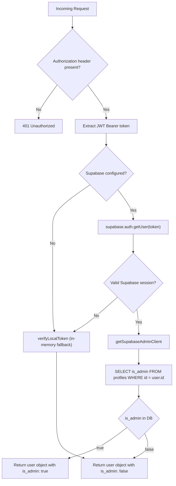

# Shokhi AI — Role-Based Access Control (RBAC) Specification

**Version:** 2.0.0 | **Runtime:** Node.js / Vercel Serverless
**Implementation:** `lib/auth.js`, `api/admin/assign_role.js`, `supabase_schema.sql`

---

## 1. Overview

Shokhi AI implements a two-tier RBAC system:

| Role | Access Level |
|---|---|
| **Mother (User)** | Own data only — maternal health tracking, AI chat, notifications |
| **Admin** | All users' data — clinical dashboard, role management, broadcast, delete |

**Core principle:** Role is **entirely database-driven** (`profiles.is_admin BOOLEAN`). There are no hardcoded credentials, no environment-variable role flags, and no JWT-baked permanent roles.

---

## 2. Role Storage

```sql
-- In the profiles table
ALTER TABLE public.profiles ADD COLUMN is_admin BOOLEAN DEFAULT FALSE;
```

- Default for all new registrations: `is_admin = false`
- One admin can grant/revoke admin on any other user
- The change takes effect on the **next API request** — no token refresh needed (live DB check)

---

## 3. Role Assignment Methods

### Method A — Admin Panel UI
1. Log in as an existing admin → navigate to `admin.html`
2. Scroll to **Role Management** section
3. Enter target user's email → click **Grant Admin** or **Revoke Admin**
4. Calls `POST /api/admin/assign_role`

### Method B — CLI Utility Script
```bash
node scripts/assign_admin.js user@example.com
```
This script directly updates `profiles.is_admin = true` via the service role key.

### Method C — Direct Supabase SQL
```sql
-- Grant
UPDATE public.profiles SET is_admin = true WHERE email = 'user@example.com';

-- Revoke
UPDATE public.profiles SET is_admin = false WHERE email = 'user@example.com';
```
Run in Supabase Dashboard → SQL Editor.

---

## 4. Role Verification Flow

Every protected API call runs through `verifyAuth()` in `lib/auth.js`:



### Key implementation detail
The `is_admin` value comes from the **live database** — not from the JWT token itself. This means:
- Revoking a user's admin in the DB takes effect immediately on their next API call
- A user cannot forge admin access by modifying their JWT

---

## 5. Admin Route Protection

Every admin endpoint uses the same guard pattern:

```js
// Example: api/admin/metrics.js
const authUser = await verifyAuth(req);
if (!authUser) return sendJsonError(res, 401, 'Authorization required.');
if (!authUser.is_admin) return sendJsonError(res, 403, 'Admin access required.');

// Safe to proceed — user is verified admin
const adminClient = getSupabaseAdminClient(); // service role key — bypasses RLS
```

### Protected Admin Endpoints

| Endpoint | Method | What it does |
|---|---|---|
| `/api/admin/metrics` | GET | Returns all users' clinical data |
| `/api/admin/assign_role` | POST | Grant or revoke `is_admin` |
| `/api/admin/delete` | DELETE | Remove any log record from any table |

All return `403 Forbidden` for non-admin tokens. Verified in E2E Test Group 9.

---

## 6. Frontend Role Routing

On `index.html` startup:

```js
// main.js — checkAuthStatus()
const res = await fetch('/api/auth/me', {
  headers: { Authorization: `Bearer ${token}` }
});
const user = await res.json();

if (user.is_admin) {
  window.location.href = '/admin.html';  // Admin → admin panel
} else {
  showMaternityApp();  // Mother → maternal health interface
}
```

On `admin.html` startup:

```js
// admin.html inline script — verifyAdminAccess()
const res = await fetch('/api/auth/me', { headers: { Authorization: `Bearer ${token}` } });
const user = await res.json();

if (!user.is_admin) {
  showAccessDenied();  // Not an admin → blocked
} else {
  showDashboard();     // Admin → show full panel
}
```

---

## 7. Supabase RLS & Admin Bypass

Standard user endpoints use the **anon key** (respects RLS):
```js
supabaseClient.from('meal_logs').select('*').eq('user_id', authUser.id)
// RLS: auth.uid()::text = user_id  ← enforced by Supabase
```

Admin endpoints use the **service role key** (bypasses RLS):
```js
getSupabaseAdminClient().from('meal_logs').select('*')
// No RLS filter → returns ALL users' rows
```

The service role key is:
- Stored only in `.env` (`SUPABASE_SERVICE_ROLE_KEY`)
- Used only in server-side Node.js API handlers
- **Never sent to the browser**

---

## 8. Security Guarantees

| Guarantee | Implementation |
|---|---|
| Role cannot be self-assigned | `assign_role` endpoint itself requires `is_admin = true` |
| Token forgery cannot elevate role | `is_admin` read from DB, not JWT payload |
| Revocation is instant | Next request re-reads DB — no cache |
| Service role key never exposed | Only in `.env`, used server-side only |
| Cross-tenant admin abuse prevented | Admin endpoints validated by auth first |

---

## 9. First Admin Bootstrap

When deploying for the first time (no admins exist yet), bootstrap the first admin directly via Supabase SQL:

```sql
-- Step 1: Get user's UUID from auth.users
SELECT id, email FROM auth.users WHERE email = 'firstadmin@example.com';

-- Step 2: Set admin flag
UPDATE public.profiles SET is_admin = true WHERE id = '<uuid-from-step-1>';
```

After this, that admin can grant others via the admin panel UI.
