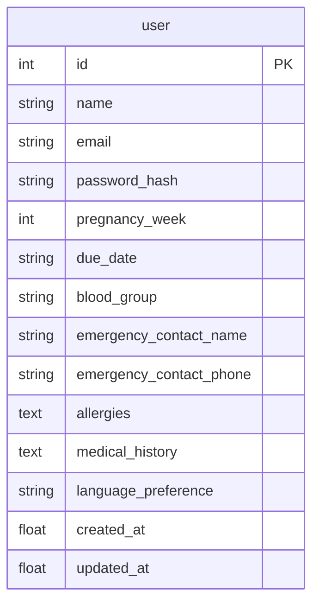

# Shokhi AI (সখী AI) — User Profile & Pregnancy Context Engine Specification (Phase 9)

**Document Version:** 1.0.0  
**Phase:** Phase 9 — User Profile & Pregnancy Context Engine  
**Date:** August 17, 2026  
**Status:** Implemented & Verified

---

## 1. Executive Summary & Capabilities

Phase 9 implements a comprehensive maternal profile engine and real-time gestational calculator that enriches Gemini AI interactions with stage-specific context (exact pregnancy week, trimester, estimated days to delivery, blood group, allergies, and medical history).

### Key Profile & Context Capabilities:
1. **Dynamic Gestational Calculator (`compute_pregnancy_metrics`):**
   * Computes trimester boundaries (1st Trimester: Weeks 1–12, 2nd Trimester: Weeks 13–26, 3rd Trimester: Weeks 27–40+).
   * Calculates days remaining until estimated delivery (~280 days total gestation).
2. **Context-Aware AI Generation:**
   * Automatically fetches the mother's profile on every `/api/ask_prova_chat` call and injects a stage context header into Gemini Generative AI prompts.
   * Shokhi delivers medically grounded advice tailored to the mother's specific week without asking repetitively.
3. **Maternal Profile CRUD (`/api/profile`):**
   * Stores blood groups (`blood_group`), emergency contact names & phone numbers, known drug/food allergies, and medical history.
4. **Multi-Tenant Profile Isolation:**
   * Enforces strict token-based authorization so each mother's private medical details are protected.

---

## 2. Profile Entity Schema

---

## 3. Endpoints Catalog

| Endpoint | Method | Access | Request Body | Description |
| :--- | :--- | :--- | :--- | :--- |
| `/api/profile` | `GET` | Bearer Token | None | Retrieves user profile with calculated trimester and days remaining. |
| `/api/profile` | `PUT` / `POST` | Bearer Token | `{name?, pregnancy_week?, due_date?, blood_group?, emergency_contact_name?, emergency_contact_phone?, allergies?, medical_history?, language_preference?}` | Updates profile fields and recalculates gestational metrics. |

---

## 4. Automated Verification Results (`test_phase9.py`)

All Phase 9 scenarios passed:
* **Initial Profile Fetch:** Status 200 (Week 8 ➔ Trimester 1 / ১ম ট্রাইমেস্টার verified).
* **Maternal Profile Update:** Status 200 (Updated to Week 24, B+, Sulfa allergy, 112 days remaining).
* **AI Context Injection:** Status 200 (Gemini chat received mother's stage context and responded).
* **Multi-Tenant Isolation:** Status 200 (User B verified with independent Week 34 / Trimester 3 profile).

---

**Phase 9 Execution Finished.**
