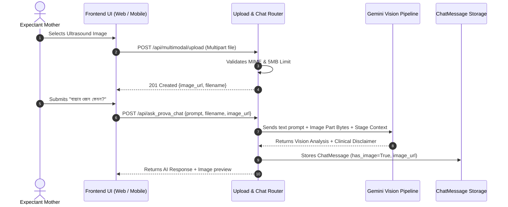

# Shokhi AI (সখী AI) — Voice & Multimodal Media Specification (Phase 12)

**Document Version:** 1.0.0  
**Phase:** Phase 12 — Voice & Multimodal Hardening  
**Date:** August 17, 2026  
**Status:** Implemented & Verified

---

## 1. Executive Summary & Capabilities

Phase 12 extends Shokhi AI with voice interaction protocols and Gemini Vision multimodal processing for medical artifacts (ultrasound reports, doctor prescriptions, dietary photos).

### Key Voice & Multimodal Capabilities:
1. **Multimodal Media Ingestion Pipeline (`/api/multimodal/upload`):**
   * Accepts image uploads in JPEG, PNG, and WebP formats.
   * Enforces strict file extension filtering and a 5MB payload limit to protect against malicious uploads and resource exhaustion.
   * Returns deterministic static URL paths (`/uploads/doc_<timestamp>_<user_id>.<ext>`).
2. **Gemini Vision Processing Engine:**
   * Packs image byte buffers directly into `google.genai.types.Part.from_bytes` payloads.
   * Generates bilingual vision analysis combining maternal stage context with image examination.
   * Automatically appends mandatory vision disclaimers reminding the mother that AI vision is assistive and not a diagnostic substitute for clinical sonography.
3. **Relational Multimodal Conversation Persistence:**
   * Tracks `has_image` and `image_url` on `ChatMessage` rows so image context is preserved across chat reloads.
4. **Bilingual Speech Engine Configuration (`/api/voice/config`):**
   * Standardizes STT (Speech-to-Text) and TTS (Text-to-Speech) parameters targeting Bengali (`bn-BD`) and English (`en-US`).

---

## 2. Multimodal Dataflow

---

## 3. Endpoints Catalog

| Endpoint | Method | Access | Request Body | Description |
| :--- | :--- | :--- | :--- | :--- |
| `/api/multimodal/upload` | `POST` | Bearer Token | `multipart/form-data` with `file` | Validates and stores image files (max 5MB, JPEG/PNG/WebP). |
| `/uploads/<filename>` | `GET` | Public / App | None | Serves stored user images. |
| `/api/voice/config` | `GET` | Public | None | Returns STT and TTS speech configuration. |

---

## 4. Automated Verification Results (`test_phase12.py`)

All Phase 12 scenarios passed:
* **Valid Image Upload:** Status 201 (`/uploads/doc_*.png` generated).
* **Invalid Extension Rejection:** Status 400 (Blocked `.exe` file format).
* **Oversized File Rejection:** Status 400 (Blocked > 5MB file).
* **Multimodal Chat Request:** Status 200 (Vision reply returned with mandatory disclaimer, `has_image=True` persisted to DB).
* **Voice Configuration:** Status 200 (`bn-BD` & `en-US` parameters verified).

---

**Phase 12 Execution Finished.**
